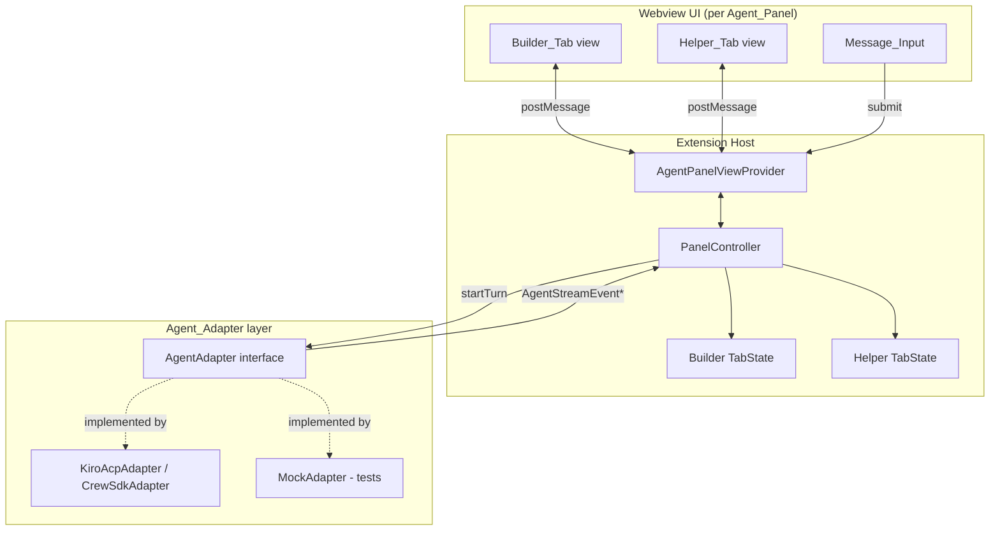

# Design Document

## Overview

This feature delivers the first vertical slice of the Vibe Helper **Code-centered UI surface**: a Kiro IDE (VS Code-based) extension that contributes a right-hand **Agent_Panel** containing two tabs, **Builder_Tab** and **Helper_Tab**. Each tab is a chat surface: the user composes a message, it is routed to the tab's agent (Builder or Helper), and the agent's reply streams back into that tab's conversation. The Builder_Tab additionally renders a transparent work stream of the Builder_Agent's tool calls, file changes, commands, and tests. The Helper_Tab is chat-only.

The design's central boundary is the **Agent_Adapter**: an interface that invokes an agent through the Kiro host and returns an ordered stream of response events (content chunks, work-stream items, completion, failure). Keeping this behind an interface lets the concrete invocation mechanism (Kiro CLI over ACP, Crew App SDK, or a Kiro custom agent) be chosen or swapped later without touching UI or state-management code. It also gives downstream product concerns (Concept Ledger, Evidence analysis, Decision cards, Live Project Context persistence, MCP Core, SQLite) a natural attachment point in a later spec — those are **out of scope here** and are only referenced where they constrain the panel.

### Scope

In scope:
- Extension activation and contribution of the Agent_Panel (a webview-based view container) to the right side.
- Webview ↔ extension messaging protocol.
- Independent per-tab conversation state (Builder vs Helper).
- The Agent_Adapter interface: start a turn, receive ordered chunks and work-stream events, completion, failure, and stall handling.
- Streaming into a tab that is not currently active.
- Builder work-stream item model with default-collapsed long output and per-item expand/collapse.
- Builder vs Helper role/permission separation as it affects the panel.
- Input validation (empty/whitespace rejection, 10,000-character limit) and error/unavailability handling.

Out of scope (constrains but is not built here): Concept Ledger, Evidence engine, Decision cards, Live Project Context persistence, MCP Core, SQLite storage, and the Agent-centered Crew App surface.

### Research Notes

The design leans on the **Agent Client Protocol (ACP)**, which Kiro CLI implements, as the reference model for the adapter. Under ACP an editor launches the agent as a subprocess and they communicate over JSON-RPC 2.0: capability negotiation, session creation, prompt turns, and streaming `session/update` notifications during a turn. Message text arrives incrementally (an `agent_message_chunk`-style update), tool-call activity arrives as tool-call updates, sensitive operations can trigger permission requests, and a turn ends with a stop reason delivered as an update rather than as the prompt response itself. Sources: [Kiro CLI ACP docs](https://kiro.dev/docs/cli/acp/), [ACP overview](https://agentclientprotocol.com/protocol/v1/overview), [ACP v2 migration notes](https://agentclientprotocol.com/protocol/v2/migration), and a community bridge noting Kiro streams via `session/update` notifications ([kiro-acp-telegram-bot](https://github.com/ajitnk-lab/kiro-acp-telegram-bot)). Content was rephrased for compliance with licensing restrictions.

Key takeaways that shape this design:
- **Chunked streaming** maps directly to Requirement 3 (`Response_Stream` of ordered chunks). The adapter normalizes host-specific update notifications into a single ordered event stream.
- **Tool-call updates** map directly to Requirement 4 (`Work_Stream_Item`). Work-stream events and message chunks arrive interleaved on the same ordered stream, which is exactly what Requirement 4.3 requires (single ordered conversation view).
- **Turn acknowledgement vs. completion** (v2 migration) reinforces treating "turn accepted" and "turn complete/failed" as distinct events — informing the start-timeout (Req 6.1) vs. stall/failure (Req 3.7) distinction.
- The exact host invocation API remains a **spike/open item**; the adapter interface below is deliberately transport-agnostic so a `KiroAcpAdapter`, `CrewSdkAdapter`, or `MockAdapter` can all satisfy it.

## Architecture

The extension follows a three-layer separation: a **Webview UI** (rendering + input), an **Extension Host** controller (state ownership + orchestration), and the **Agent_Adapter** (agent invocation). State lives in the extension host, not the webview, so it survives webview disposal/reload and so both tabs' streams can be driven independently of which tab is visible.



### Data flow: submit → stream → render

```mermaid
sequenceDiagram
    participant U as User
    participant W as Webview (Tab)
    participant C as PanelController
    participant S as TabState
    participant A as AgentAdapter

    U->>W: type + submit message
    W->>C: submit{tabId, text}
    C->>C: validate (non-empty, <=10k)
    alt invalid
        C-->>W: rejected{reason}
    else valid
        C->>S: append User_Message; lock submission
        C-->>W: render user msg + in-progress; disable input
        C->>A: startTurn(agentId, text, handler)
        A-->>C: ResponseStarted -> create Agent_Response
        loop chunks / work-stream items
            A-->>C: MessageChunk | WorkStreamItem
            C->>S: append in receipt order
            C-->>W: patch tab view (even if inactive)
        end
        alt completes
            A-->>C: Completed
            C->>S: mark complete; unlock
        else fails / stalls >30s
            A-->>C: Failed | (watchdog fires)
            C->>S: mark failed; retain partial; unlock
        end
        C-->>W: finalize + re-enable input
    end
```

### Key architectural decisions

- **State in the extension host, not the webview.** VS Code webviews can be disposed when hidden and recreated on reveal. Owning state in the host (Req 1.5 restore, Req 1.6 independence, Req 3.5 stream-to-inactive-tab) makes those behaviors natural: the webview is a projection that can be re-hydrated from host state at any time. *Rationale:* avoids losing an in-flight Builder stream when the user switches to Helper.
- **One controller, two tab states, N in-flight turns.** The `PanelController` owns a `TabState` per agent. Each `TabState` can have at most one in-flight turn (submission lock, Req 2.6/3.3), but Builder and Helper can stream concurrently (Req 5.4).
- **Adapter emits a single normalized event stream.** Rather than separate callbacks for "text" and "tools," the adapter yields one ordered `AgentStreamEvent` sequence. This guarantees the interleaved ordering Requirement 4.2/4.3 needs and keeps chunk ordering (Req 3.2/3.6) a property of a single sequence.
- **Adapter is transport-agnostic.** Concrete adapters (`KiroAcpAdapter`, later `CrewSdkAdapter`) normalize host events into `AgentStreamEvent`s. A `MockAdapter` drives tests deterministically. *Rationale:* the real Kiro invocation API is an open spike item; the panel must not hard-bind to it.
- **Webview messaging is a small, versioned protocol.** Host→webview messages are render patches; webview→host messages are user intents. Keeping it minimal reduces coupling and makes the UI layer swappable (Req: Code-mode panel shares the same session/state model as Agent-mode later).

## Components and Interfaces

### Extension activation & view contribution

- `activate(context)` registers an `AgentPanelViewProvider` as a webview view provider bound to a right-side view container contributed via `package.json` (`viewsContainers.activitybar`/`views` or a secondary side panel). Activation must complete and contribute the panel within 3s (Req 1.1).
- The provider creates the webview, injects the UI bundle, and wires the messaging channel to the `PanelController`.

```typescript
interface AgentPanelViewProvider {
  resolveWebviewView(view: WebviewView): void; // wires webview <-> PanelController
}
```

### PanelController (extension host)

Owns all state and orchestration. Pure-logic core (validation, ordering, lock transitions) is separated from VS Code API calls so it can be unit/property-tested without a running IDE.

```typescript
type TabId = "builder" | "helper";

interface PanelController {
  readonly activeTab: TabId;
  selectTab(tab: TabId): void;                 // Req 1.4, 1.5
  submit(tab: TabId, text: string): SubmitResult; // Req 2, 5
  getTabState(tab: TabId): TabStateSnapshot;   // for re-hydration (Req 1.5, 3.5)
}

type SubmitResult =
  | { status: "accepted"; messageId: string }
  | { status: "rejected"; reason: "empty" | "too_long"; retainedText: string } // Req 2.4, 2.5
  | { status: "locked" }        // Req 2.6 in-progress in that tab
  | { status: "unavailable" };  // Req 6.4
```

### TabState (per agent, extension host)

```typescript
interface TabState {
  readonly tabId: TabId;
  entries: ConversationEntry[]; // ordered User_Message and Agent_Response entries
  draft: string;                // unsent Message_Input text (Req 1.5)
  inFlight: InFlightTurn | null; // submission lock (Req 2.6)
  appendUserMessage(text: string): string;      // returns messageId
  beginResponse(forMessageId: string): string;  // returns responseId (Req 3.1)
  appendChunk(responseId: string, chunk: string): void; // Req 3.2 order preserved
  appendWorkItem(responseId: string, item: WorkStreamItem): void; // Req 4 (builder only)
  completeResponse(responseId: string): void;    // Req 3.3
  failResponse(responseId: string): void;        // Req 3.7, 6.2 — retains partial content
}
```

Builder and Helper each get an isolated `TabState` instance; the controller never shares mutable structures between them (Req 1.6).

### Agent_Adapter (invocation boundary)

```typescript
type AgentId = "builder" | "helper";

interface AgentAdapter {
  isAvailable(agent: AgentId): Promise<boolean>; // Req 6.4
  // Starts a turn. Emits ordered events via onEvent. Resolving the returned
  // handle means "turn accepted"; completion/failure arrive as events.
  startTurn(req: StartTurnRequest, onEvent: (e: AgentStreamEvent) => void): Promise<TurnHandle>;
}

interface StartTurnRequest {
  agent: AgentId;
  text: string;
  // capability hint: only the builder turn is permitted to emit work-stream items
  allowWorkStream: boolean; // true for builder, false for helper
}

interface TurnHandle {
  readonly turnId: string;
  cancel(): void;
}

// Single normalized, ordered event stream for one turn.
type AgentStreamEvent =
  | { kind: "started"; turnId: string }                       // Req 3.1
  | { kind: "message_chunk"; text: string }                   // Req 3.2
  | { kind: "work_item"; item: WorkStreamItem }               // Req 4.1 (builder only)
  | { kind: "work_item_result"; itemId: string; failed: boolean } // Req 4.6
  | { kind: "completed" }                                      // Req 3.3
  | { kind: "failed"; error: AdapterError };                   // Req 3.7, 6.2
```

- `KiroAcpAdapter` (target host): normalizes ACP `session/update` notifications — message chunks → `message_chunk`, tool-call updates → `work_item`/`work_item_result`, stop reason → `completed`/`failed`.
- `MockAdapter` (tests): scripts arbitrary event sequences and timings, enabling deterministic property tests for ordering, streaming-to-inactive-tab, lock behavior, and failure/partial-retention.

### Stall watchdog

The controller wraps each in-flight turn with two timers, owned in the host (independent of webview visibility):
- **Start timeout (30s):** if no `started` event arrives within 30s of submission → treat as start failure (Req 6.1): error indication, unlock, retain composed text.
- **Stall timeout (30s):** reset on every `message_chunk`/`work_item`; if it elapses with no new event → mark response failed, retain partial content, unlock (Req 3.7).

### Webview messaging protocol

Host → Webview (render/patch):
```typescript
type HostToWebview =
  | { type: "hydrate"; tabs: Record<TabId, TabStateSnapshot>; activeTab: TabId }
  | { type: "tabActivated"; tab: TabId }
  | { type: "entryAdded"; tab: TabId; entry: ConversationEntry }
  | { type: "chunkAppended"; tab: TabId; responseId: string; text: string }
  | { type: "workItemAdded"; tab: TabId; responseId: string; item: WorkStreamItem }
  | { type: "responseState"; tab: TabId; responseId: string; state: "in_progress" | "complete" | "failed" }
  | { type: "submissionState"; tab: TabId; enabled: boolean }
  | { type: "notice"; tab: TabId; kind: "error" | "unavailable" | "length_limit"; message: string };
```

Webview → Host (intents):
```typescript
type WebviewToHost =
  | { type: "selectTab"; tab: TabId }
  | { type: "submit"; tab: TabId; text: string }
  | { type: "draftChanged"; tab: TabId; text: string }   // enables Req 1.5 unsent-text restore
  | { type: "toggleWorkItem"; tab: TabId; itemId: string }; // Req 4.5 (view-local, but reported for persistence-free re-hydration)
```

Rendering (Req 3.5) applies `chunkAppended`/`workItemAdded` to the addressed tab regardless of which tab is visible; if that tab is not mounted/visible, the patch updates host-side snapshot and is replayed on next `hydrate`.

## Data Models

```typescript
type EntryKind = "user_message" | "agent_response";

interface ConversationEntry {
  id: string;
  kind: EntryKind;
  createdAt: number;
  seq: number; // monotonic within a tab; defines render order
}

interface UserMessageEntry extends ConversationEntry {
  kind: "user_message";
  text: string; // 1..10000 chars, non-whitespace-only
}

interface AgentResponseEntry extends ConversationEntry {
  kind: "agent_response";
  forMessageId: string;
  chunks: string[];          // appended in receipt order (Req 3.2/3.6)
  workItems: WorkStreamItem[]; // builder only; interleave position tracked by seq
  state: "in_progress" | "complete" | "failed"; // Req 3.3/3.7/6.2/6.3
}

interface WorkStreamItem {
  id: string;
  seq: number;               // ordering within the response (Req 4.2)
  itemType: "tool_call" | "file_change" | "command" | "test";
  title: string;
  detail: string;            // may be multi-line
  lineCount: number;         // used to decide default-collapsed (Req 4.4)
  status: "running" | "succeeded" | "failed"; // Req 4.6
  expanded: boolean;         // default false when lineCount > 3 (Req 4.4)
}

interface InFlightTurn {
  turnId: string;
  responseId: string;
  handle: TurnHandle;
  lastEventAt: number; // for stall watchdog
}

interface TabStateSnapshot {
  tabId: TabId;
  entries: ConversationEntry[];
  draft: string;
  submissionEnabled: boolean;
  activeAgentLabel: string; // Req 5.5
}

interface AdapterError {
  code: "start_timeout" | "stream_error" | "stalled" | "unavailable" | "unknown";
  message: string;
}
```

Ordering rule: every entry and every work item carries a monotonic `seq` assigned at receipt time. Render order is strictly `seq` ascending, and work items interleave with chunks by `seq` inside their response — the UI never reorders (Req 4.2). Work items are only ever attached to a Builder tab response because `allowWorkStream` is false for Helper turns and the Helper `TabState` rejects work items (Req 4.7).

## Acceptance Criteria Testing Prework

This feature is a UI extension, but its heart is a **pure controller/state core** (validation, ordering, submission-lock transitions, per-tab independence, partial-content retention) that is highly amenable to property-based testing when the VS Code and adapter boundaries are replaced with test doubles. Timing thresholds (3s activation, 500ms, 200ms, 30s) and actual IDE contribution/rendering are integration or example concerns, not properties.

Acceptance Criteria Testing Prework:

1.1 Extension contributes Agent_Panel within 3 seconds
  Thoughts: Tests VS Code extension activation + view contribution and a latency budget. This is IDE integration behavior, not input-varying logic.
  Classification: INTEGRATION
  Test Strategy: Activate the extension in a VS Code extension-host test; assert the view is contributed and appears within budget.

1.2 Panel presents exactly two tabs Builder and Helper
  Thoughts: A fixed structural fact; no input variation.
  Classification: EXAMPLE
  Test Strategy: Render the panel; assert exactly two tabs with the expected labels.

1.3 First display selects Builder, empty conversation, empty editable input
  Thoughts: Specific initial-state scenario, deterministic.
  Classification: EXAMPLE
  Test Strategy: Construct a fresh controller; assert active tab is Builder, zero entries, empty draft.

1.4 Selecting a tab activates it (<500ms), renders it, deactivates the other
  Thoughts: The active/inactive invariant (exactly one active) is a property over any sequence of selections; the 500ms budget is a UI concern.
  Classification: PROPERTY (state) + INTEGRATION (latency)
  Test Strategy: For any sequence of selectTab calls, exactly one tab is active and it equals the last selected. Latency measured separately in UI test.

1.5 Returning to a tab restores its conversation order and unsent input
  Thoughts: A round-trip/restore property: switching away and back preserves entries (in order) and draft. Varies with arbitrary conversation/draft content.
  Classification: PROPERTY
  Test Strategy: For any tab state and any switch-away-then-back sequence, the re-hydrated snapshot equals the pre-switch snapshot (entries in order, draft text).

1.6 Builder and Helper states are independent stores
  Thoughts: Classic independence property: mutating one tab never changes the other. Varies with arbitrary operation sequences.
  Classification: PROPERTY
  Test Strategy: For any interleaving of operations on both tabs, operations targeting one tab leave the other tab's snapshot unchanged.

1.7 If rendering a tab's conversation fails, show error and preserve that tab's state
  Thoughts: Error-preservation invariant. Can be a property: injected render failure never mutates conversation state.
  Classification: PROPERTY
  Test Strategy: For any tab state, a render failure leaves entries unchanged and produces an error indication.

2.1 Message_Input accepts up to 10,000 characters
  Thoughts: Boundary of the validation rule; covered by the validation property/edge cases.
  Classification: EDGE_CASE
  Test Strategy: Generators produce lengths around the 10,000 boundary; validation accepts <=10000.

2.2 Non-empty submit appends to conversation and sends to Active_Agent via adapter
  Thoughts: For any valid message, submission appends exactly one user entry and invokes the adapter once for the active agent. Input varies.
  Classification: PROPERTY
  Test Strategy: For any valid text and active tab, after submit the tab gains one user entry and the mock adapter received exactly one startTurn for that agent.

2.3 Successful submit clears the input
  Thoughts: For any valid submission, draft becomes empty. Property.
  Classification: PROPERTY
  Test Strategy: For any valid text, post-accept draft is empty.

2.4 Empty/whitespace-only submit is rejected and does not invoke the agent
  Thoughts: For any whitespace-only string, submission is rejected and no adapter call occurs. "Empty" includes all-whitespace — property.
  Classification: PROPERTY
  Test Strategy: For any string of only whitespace, submit returns rejected(empty), no startTurn, state unchanged.

2.5 Over-limit submit is rejected, text retained, length indication shown
  Thoughts: For any string >10000 chars, reject + retain + notice. Property with boundary emphasis.
  Classification: PROPERTY
  Test Strategy: For any text length >10000, submit returns rejected(too_long) with retainedText equal to input, no startTurn.

2.6 While a response is in progress, new submissions in that tab are disabled until it completes/fails
  Thoughts: Submission-lock invariant over any event sequence — a strong property.
  Classification: PROPERTY
  Test Strategy: For any turn lifecycle, while inFlight != null submit returns locked; after completed/failed submit is accepted again.

2.7 Send failure shows error and retains message for resubmission
  Thoughts: For any send failure, error indication + retained text. Property.
  Classification: PROPERTY
  Test Strategy: For any valid text with adapter start failure, controller shows error and retains composed text.

3.1 On stream start, create an Agent_Response entry in the originating tab
  Thoughts: For any started event, exactly one response entry appears in the correct tab. Property.
  Classification: PROPERTY
  Test Strategy: For any turn, first started event yields exactly one agent_response entry in the originating tab.

3.2 Chunks appended in receipt order within 200ms
  Thoughts: Ordering is the core property (order preserved for any chunk sequence); the 200ms latency is UI.
  Classification: PROPERTY (order) + INTEGRATION (latency)
  Test Strategy: For any sequence of chunks, the response's concatenated chunks equal the concatenation in receipt order.

3.3 On completion, mark response complete and re-enable submission
  Thoughts: For any turn, completion sets state=complete and unlocks. Property (part of lock invariant).
  Classification: PROPERTY
  Test Strategy: For any turn, after completed event state is complete and submission enabled.

3.4 In-progress indicator visible while streaming
  Thoughts: UI indicator + latency budget; not input-varying logic beyond the state flag already covered.
  Classification: INTEGRATION
  Test Strategy: UI test asserts indicator visible while state=in_progress and hidden after.

3.5 Builder stream received while Helper active applies to Builder tab without switching active tab
  Thoughts: Strong property: streaming into a non-active tab never changes activeTab and content lands in the correct tab. Varies with which tab is active and event content.
  Classification: PROPERTY
  Test Strategy: For any active tab and any stream targeting the other tab, activeTab is unchanged and content is applied to the target tab.

3.6 On completion the conversation shows the full ordered set of chunks as one response
  Thoughts: Subsumed by 3.2 ordering property plus 3.3 completion — the completed response equals ordered concatenation.
  Classification: PROPERTY (consolidate with 3.2)
  Test Strategy: Covered by the chunk-ordering property asserted at completion.

3.7 Stream failure/stall >30s marks failed, retains received content, shows error, re-enables submission
  Thoughts: For any partial chunk sequence then failure/stall, all received chunks are retained and state=failed and unlocked. Property (stall timer itself is timing, tested with a controllable clock).
  Classification: PROPERTY
  Test Strategy: For any prefix of chunks followed by failure/stall, response retains that exact prefix, state=failed, submission re-enabled.

4.1 Builder work activity renders a Work_Stream_Item within 500ms
  Thoughts: Item creation is logic (a work_item event yields an item); the 500ms is UI latency.
  Classification: PROPERTY (creation) + INTEGRATION (latency)
  Test Strategy: For any work_item event on a builder turn, a matching item is added to the builder response.

4.2 Work items rendered in ascending report order, no reordering
  Thoughts: Ordering property over any work-item sequence.
  Classification: PROPERTY
  Test Strategy: For any sequence of work items, rendered order equals report (seq) order.

4.3 Work items and message content in a single ordered conversation
  Thoughts: Interleave-ordering property: chunks and work items ordered by receipt seq within the response.
  Classification: PROPERTY (consolidate with 4.2/3.2)
  Test Strategy: For any interleaved sequence of chunks and work items, the combined render order equals receipt order.

4.4 Output >3 lines renders collapsed by default with expand/collapse control
  Thoughts: For any work item, expanded default == (lineCount <= 3). Property.
  Classification: PROPERTY
  Test Strategy: For any work item, default expanded is false iff lineCount > 3, and a toggle control exists.

4.5 Toggling one item changes only that item's expanded state
  Thoughts: Independence/locality property over any set of items and toggles.
  Classification: PROPERTY
  Test Strategy: For any items and any toggle target, only the target's expanded flips; others unchanged.

4.6 Failed tool/command/test renders item with failure indication and retains it
  Thoughts: For any work_item_result(failed), the item's status becomes failed and remains present. Property.
  Classification: PROPERTY
  Test Strategy: For any failed result event, the item status is failed and it remains in the list.

4.7 Helper tab never renders work items
  Thoughts: Invariant: Helper TabState/turn never holds work items. Property.
  Classification: PROPERTY
  Test Strategy: For any helper turn and any events, the helper tab contains zero work items (adapter given allowWorkStream=false; state rejects any).

5.1 Builder submit routes to Builder_Agent, not Helper
  Thoughts: Routing property.
  Classification: PROPERTY
  Test Strategy: For any valid builder submit, adapter startTurn.agent == builder and no helper invocation.

5.2 Helper submit routes to Helper_Agent, not Builder
  Thoughts: Symmetric routing property.
  Classification: PROPERTY (consolidate with 5.1)
  Test Strategy: For any valid helper submit, adapter startTurn.agent == helper and no builder invocation.

5.3 Helper tab is chat-only (no code-edit/shell/decision controls)
  Thoughts: Structural UI fact.
  Classification: EXAMPLE
  Test Strategy: Render Helper tab; assert absence of edit/shell/decision controls.

5.4 While Builder processes, Helper stays enabled and routable
  Thoughts: Concurrency property: an in-flight builder turn does not lock the helper tab. Consolidates with lock-independence.
  Classification: PROPERTY
  Test Strategy: For any in-flight builder turn, helper submit is accepted and routes to helper.

5.5 Active agent label names the current Active_Agent
  Thoughts: For any active tab, label matches. Property, but simple; treat as example.
  Classification: EXAMPLE
  Test Strategy: Select each tab; assert label names the corresponding agent.

5.6 Routing failure retains unsent text and shows a routing-failure error
  Thoughts: Consolidates with 2.7 send-failure retention property.
  Classification: PROPERTY (consolidate with 2.7)
  Test Strategy: Covered by send-failure retention property.

6.1 No stream start within 30s → error, re-enable, retain text
  Thoughts: Start-timeout behavior; timing tested with controllable clock; retention/unlock is property.
  Classification: PROPERTY (with test clock)
  Test Strategy: For any submit where no started event arrives before the start-timeout, controller errors, unlocks, retains text.

6.2 Stream error before completion → mark failed, retain partial, re-enable
  Thoughts: Consolidates with 3.7 (failure retains received content, unlocks).
  Classification: PROPERTY (consolidate with 3.7)
  Test Strategy: Covered by the partial-retention-on-failure property.

6.3 Failed response is visually distinguished from a completed one
  Thoughts: The state flag (failed vs complete) is set; visual distinction is UI.
  Classification: PROPERTY (state) + INTEGRATION (visual)
  Test Strategy: State property covered by 3.3/3.7; UI test asserts distinct styling.

6.4 Active_Agent unavailable at submit → unavailability indication, retain text, re-enable
  Thoughts: For any submit while adapter reports unavailable, no turn starts, text retained, submission enabled. Property.
  Classification: PROPERTY
  Test Strategy: For any valid text with isAvailable=false, submit returns unavailable, retains text, no startTurn.

6.5 Error/unavailability indications preserve existing conversation history
  Thoughts: Preservation invariant across error paths — property.
  Classification: PROPERTY
  Test Strategy: For any tab history and any error/unavailability path, prior entries are unchanged.

### Property Reflection

Consolidations applied to remove redundancy:
- 3.6 folds into the **chunk-ordering** property (3.2) asserted at completion.
- 4.3 folds into a single **interleave-ordering** property covering chunks and work items (3.2/4.2).
- 5.2 folds into the **routing** property (5.1) stated symmetrically.
- 5.6 and 6.2 fold into **send-failure/partial-retention** properties (2.7 / 3.7).
- 5.4 folds into the **submission-lock independence** property.
- 6.3's state aspect folds into completion/failure state properties (3.3/3.7).

Each remaining property below provides unique validation value. Latency budgets (Req 1.1, 1.4, 3.2, 3.4, 4.1) and structural/IDE facts (Req 1.1–1.3, 5.3, 5.5) are validated by integration/example tests, not properties.

## Correctness Properties

*A property is a characteristic or behavior that should hold true across all valid executions of a system — essentially, a formal statement about what the system should do. Properties serve as the bridge between human-readable specifications and machine-verifiable correctness guarantees.*

These properties target the pure controller/state core, exercised with a `MockAdapter` and an in-memory clock so that timing-dependent behavior is deterministic.

### Property 1: Exactly one active tab

*For any* sequence of `selectTab` operations starting from a fresh panel, exactly one tab is active at all times, and the active tab equals the most recently selected tab (Builder if none selected yet).

**Validates: Requirements 1.3, 1.4**

### Property 2: Tab switch preserves conversation order and draft

*For any* tab state and *any* sequence of switch-away-then-return operations, the returned tab's re-hydrated snapshot has the same conversation entries in the same order and the same unsent draft text as before the switch.

**Validates: Requirements 1.5**

### Property 3: Tab state independence

*For any* interleaving of operations across both tabs, every operation that targets one tab leaves the other tab's snapshot (entries, draft, submission state, in-flight response) unchanged.

**Validates: Requirements 1.6**

### Property 4: State preserved across render/error faults

*For any* tab state, injecting a render failure or displaying an error/unavailability indication leaves that tab's existing conversation entries unchanged in content and order.

**Validates: Requirements 1.7, 6.5**

### Property 5: Valid submission appends exactly one user message and invokes the active agent once

*For any* text that is non-empty, not whitespace-only, and at most 10,000 characters, submitting it from a tab appends exactly one user-message entry to that tab and results in exactly one adapter `startTurn` for that tab's agent, with the draft cleared.

**Validates: Requirements 2.2, 2.3**

### Property 6: Invalid submissions are rejected without invoking the agent

*For any* string that is empty or contains only whitespace, or *any* string longer than 10,000 characters, submission is rejected, no adapter `startTurn` occurs, the tab's conversation state is unchanged, and the composed text is retained (with a length indication for the over-limit case).

**Validates: Requirements 2.1, 2.4, 2.5**

### Property 7: Submission lock holds per tab across a turn lifecycle

*For any* turn lifecycle in a tab, once the turn is in progress every further submit in that tab is refused as locked, and submission becomes accepted again exactly when the turn reaches completion or failure — while the other tab's submission availability is never affected by this lock.

**Validates: Requirements 2.6, 3.3, 5.4**

### Property 8: Response content preserves receipt order (chunks and work items interleaved)

*For any* sequence of message chunks and work-stream items received for a turn, the resulting Agent_Response renders them strictly in receipt order with no reordering, and at completion the response's ordered content equals the concatenation of all received chunks interleaved with work items by receipt order.

**Validates: Requirements 3.1, 3.2, 3.6, 4.1, 4.2, 4.3**

### Property 9: Streaming targets the originating tab without changing the active tab

*For any* active tab and *any* response stream whose originating tab differs from the active tab, every streamed chunk and work item is applied to the originating tab and the active tab remains unchanged throughout the stream.

**Validates: Requirements 3.5**

### Property 10: Failure or stall retains all content received so far and unlocks

*For any* prefix of chunks/work items received before a stream error, a start-timeout, or a stall beyond the timeout, the corresponding response retains exactly that received content in order, is marked failed, and submission in that tab is re-enabled; the text composed for a start failure or unavailability is retained for resubmission.

**Validates: Requirements 2.7, 3.7, 6.1, 6.2, 6.4**

### Property 11: Work-item default-collapsed rule and toggle locality

*For any* work-stream item, its default expanded state is collapsed exactly when its output exceeds 3 lines; and *for any* set of work items, toggling one item's expand/collapse state changes only that item's expanded state and preserves all others.

**Validates: Requirements 4.4, 4.5**

### Property 12: Failed work items are marked and retained

*For any* reported tool call, command execution, or test run that fails, the corresponding work-stream item is marked with failure status and remains present in the Builder_Tab conversation.

**Validates: Requirements 4.6**

### Property 13: Work items only ever appear in the Builder tab

*For any* Helper turn and *any* sequence of adapter events, the Helper_Tab conversation contains zero work-stream items.

**Validates: Requirements 4.7**

### Property 14: Messages route to the submitting tab's agent only

*For any* valid submission from a tab, the adapter is invoked for that tab's agent and never for the other agent (Builder submissions reach only the Builder_Agent; Helper submissions reach only the Helper_Agent).

**Validates: Requirements 5.1, 5.2**

## Error Handling

- **Empty/whitespace input (Req 2.4):** rejected at the controller before any adapter call; state untouched; no notice required beyond leaving input as-is (the submit control simply does nothing meaningful).
- **Over-limit input (Req 2.5):** rejected with `rejected(too_long)`; the composed text is retained and a `notice{kind:"length_limit"}` is emitted to the tab.
- **Start failure / start timeout (Req 6.1):** if `startTurn` rejects or no `started` event arrives within 30s, emit `notice{kind:"error"}`, re-enable submission, retain composed text. No response entry is left dangling (if one was created it is marked failed).
- **Stream error mid-turn (Req 3.7, 6.2):** the current response is marked `failed`, all received chunks/work items are retained, `notice{kind:"error"}` is shown, submission re-enabled.
- **Stall (Req 3.7):** a 30s watchdog per in-flight turn, reset on each event, triggers the same failed-with-retained-content path as a stream error.
- **Agent unavailable at submit (Req 6.4):** `isAvailable` is checked (or an immediate unavailable error from `startTurn` is treated equivalently); emit `notice{kind:"unavailable"}`, retain text, keep submission enabled, no response entry created.
- **Routing failure (Req 5.6):** treated as a start failure with an error notice that identifies the failed target agent; unsent text retained.
- **Render failure (Req 1.7):** caught at the tab render boundary; an error indication is shown for that tab while host-side conversation state is preserved and can be re-hydrated.
- **History preservation (Req 6.5):** every error/unavailability path only appends notices or flips response state; it never removes or edits prior entries.
- **Failed vs complete distinction (Req 6.3):** carried by `AgentResponseEntry.state`, rendered with distinct styling.

Adapter errors are normalized to `AdapterError` codes (`start_timeout`, `stream_error`, `stalled`, `unavailable`, `unknown`) so the controller reacts uniformly regardless of the concrete host mechanism.

## Testing Strategy

### Property-based tests (pure core)

Property-based testing **is appropriate** for the controller/state core: it is pure input/output logic with universal invariants (ordering, independence, lock transitions, validation, retention) over a large input space (arbitrary text, arbitrary event sequences, arbitrary tab-operation interleavings). The VS Code API and the real agent host are replaced with a `MockAdapter` and an in-memory clock.

- **Library:** [`fast-check`](https://github.com/dubzzz/fast-check) with the TypeScript test runner already used by the project (Jest or Vitest).
- **Do not** implement a PBT engine by hand; use `fast-check` generators and `fc.assert`.
- **Iterations:** each property test runs a minimum of **100 iterations** (`fc.assert(prop, { numRuns: 100 })`).
- **Tagging:** each property test is annotated with a comment of the form
  `// Feature: builder-helper-agent-panel, Property {number}: {property_text}`.
- **One property → one test:** each of Properties 1–14 is implemented by a single property-based test.
- **Generators:** arbitraries for user text (including whitespace-only and around the 10,000-char boundary), for `AgentStreamEvent` sequences (interleaved chunks/work items, terminated by completed/failed/stall), for work items (varying `lineCount`, statuses), and for interleaved two-tab operation scripts.
- **Clock:** a controllable fake clock drives start-timeout and stall-watchdog properties (Properties 7, 10) deterministically.

### Example-based unit tests

- Fresh-panel initial state: Builder active, empty conversation, empty input (Req 1.3).
- Exactly two tabs with correct labels (Req 1.2).
- Helper tab exposes no code-edit/shell/decision controls (Req 5.3).
- Active-agent label matches the selected tab (Req 5.5).
- Representative failure notices render with correct copy and kind.

### Integration tests (VS Code extension host + webview)

Integration tests cover the IDE contribution and latency-bound / rendering behaviors that are **not** input-varying and are unsuitable for PBT:

- Extension activates and contributes the Agent_Panel to the right side within 3s (Req 1.1).
- Tab activation renders within 500ms and swaps active/inactive (Req 1.4 latency).
- Streamed chunks appear in the view within 200ms of receipt (Req 3.2 latency), and the in-progress indicator is visible while streaming and hidden after (Req 3.4).
- Work-stream items appear within 500ms and long items render collapsed with a working expand/collapse control (Req 4.1 latency, 4.4 UI).
- Failed responses render visually distinct from completed ones (Req 6.3 visual).
- Webview disposal/re-reveal re-hydrates from host state, preserving conversation order and draft (Req 1.5 end-to-end).

A thin **smoke test** against the real `KiroAcpAdapter` (once the host invocation spike lands) verifies a single end-to-end turn streams and completes; this is intentionally minimal (1–2 examples) because it exercises the external host, not this feature's logic.
