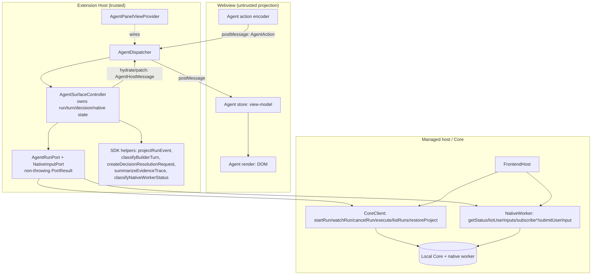
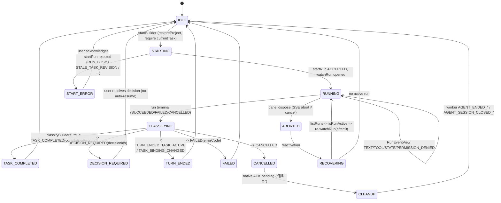
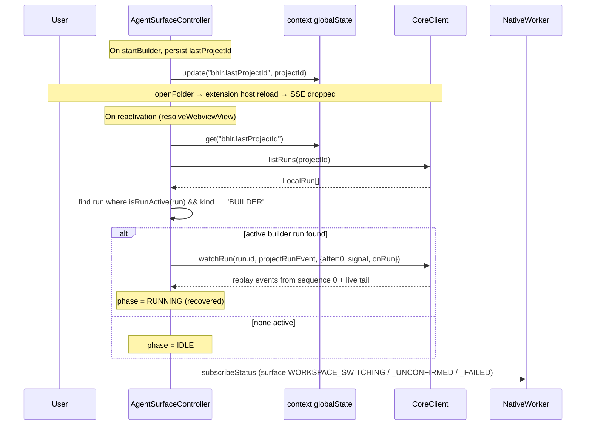

# Design Document: builder-helper-live-runs

## Overview

This feature wires the extension's **Builder / Helper** agent surfaces (and the remaining §4 areas: Decision resolution, run cancellation, native user inputs, generated-workspace open, launch result, evidence trace, final upgrade, and native worker status) to the **real local Core** through the already-integrated managed host (`vendor/frontend-host` `FrontendHost`). It replaces the current Demo / `PanelController` path for the agent surfaces in product mode, while leaving the shipped Discovery / Spec / History flow (and its 228 green tests) fully intact.

The backend shipped a detailed contract (`BACKEND_HANDOFF_INTEGRATION_STATUS.md` §3/§4 and the vendored `.d.ts` types). This design turns that contract into a buildable architecture. It follows the exact same host-owned-state pattern already used by the `FlowController` for Discovery/Spec/History: a host-side controller owns all run / turn / decision / native-question state, and the webview is a **pure projection** that receives `hydrate` / `patch` messages and sends back only discriminated semantic actions. Connection objects, tokens, the host object, and absolute `workspaceDirectory` values **never** cross into the webview (§9 security). SSE `watchRun` is the transport for live Builder/Helper turns, so the design specifies the `AbortController` lifecycle precisely (panel dispose aborts the subscription only; explicit user "stop" calls `cancelRun`).

Because this dev PC is Kiro 1.0.293 (an unsupported pin), the live runtime is fail-closed; the design's test strategy is therefore **deterministic** — a fake `CoreClient` / `NativeWorker` plus the real SDK helpers, mirroring the existing `test/support` harness and `local-core-port.test.ts` fakes. No live model calls occur in tests.

Backend contract references used throughout: `program/vendor/frontend-host/index.d.ts`, `program/vendor/frontend-client/types/esm/workflow-view.d.ts`, `program/vendor/frontend-client/types/esm/index.d.ts`, `program/vendor/frontend-client/types/esm/contracts/local-runtime.d.ts`, and the §3.1–§3.9 handoff sections.

---

## Architecture

_High-Level Design (Diagrams & Interfaces)_

### High-Level Architecture

The agent surfaces adopt the same three-layer topology the flow already uses, but around a **new** host-side controller (`AgentSurfaceController`) driving live runs. The managed `FrontendHost` (created once on activation) exposes `client: CoreClient` and `worker: NativeWorker`; the controller consumes both through a thin, non-throwing **`AgentRunPort`** (mirroring `DiscoveryPort`/`SpecPort`) so the controller never binds to a transport and stays unit-testable with a fake.



Key properties:

- **Single source of truth is the host.** The webview holds only a projected `AgentViewModel`. Every user gesture is a discriminated `AgentAction`; the host re-validates it against the current durable snapshot before touching Core.
- **Runs are transient; completion is durable.** SSE events (`watchRun`) drive live rendering, but "task complete" is decided only by `classifyBuilderTurn(run, afterSnapshot, taskId) === TASK_COMPLETED`, never by `run.status === 'SUCCEEDED'` alone.
- **Additive, non-breaking.** The controller/dispatcher/messages live in new modules under `src/core/agent/`, `src/adapter/agent/`, `src/webview/agent/`. The existing `PanelController`/`WebviewDispatcher` (Build_Surface Demo) is superseded in product mode only (see §A.6 decision).

### State model (Builder turn)

The Builder turn is a small state machine owned per Project. The webview mirrors `phase` only for display.



### Window-switch reload recovery (§3.1 critical)

Starting a Builder run may `openFolder` and reload the extension host, which kills the SSE stream. Recovery is a **required** part of the Builder design, not an add-on.



Worker stages relevant to recovery (classified via `classifyNativeWorkerStatus`, never by raw suffix): `WORKSPACE_SWITCHING`, `WORKSPACE_SWITCH_UNCONFIRMED` (surfaced as a diagnostic code inside `DIAGNOSTIC`/`WORKSPACE_SWITCHING` stage per the classifier's mapping), `WORKSPACE_SWITCH_FAILED`.

### Product-mode replacement decision (recommended)

**Recommendation: a new `AgentSurfaceController` supersedes the `PanelController`/Demo Build_Surface in product mode; the Demo path is retained for development/tests only.**

Rationale:
- The shipped patch already **blocks** the Demo `submit` in product mode (`agent-panel-view-provider.ts` posts a "next step" notice when `managedHost` is present). This feature completes that intent by routing agent gestures to the live controller instead of returning a placeholder notice.
- The Demo `PanelController` has no concept of runs, decisions, native questions, or completion reports; retrofitting it would entangle Demo timers with live SSE lifecycles. A separate controller keeps the live state machine cohesive and keeps `PanelController`'s 228-green behavior untouched for dev/test.
- Selection is by construction argument, exactly like the flow: when `managedHost` is present, `wireWebviewMessaging` constructs the `AgentSurfaceController` (live) and leaves `PanelController` un-wired for inbound agent actions; when absent (dev/tests), the existing Demo path stays.

This is additive: no existing `HostToWebview` message shape or `PanelController` state changes; only new `AgentHostMessage` types are added over the same transport.

---

## Data Models

_Safe projections only._

All webview-bound models are **DTOs derived from SDK view types** — no connection, no token, no absolute path. The host holds the raw `LocalRun` / `ProjectSessionSnapshot`; it projects the following:

```typescript
// src/core/agent/agent-view-model.ts  (host-owned, posted to webview)

/** Top-level agent surface projection. */
export interface AgentViewModel {
  readonly surface: 'BUILDER' | 'HELPER';
  readonly builder: BuilderTurnViewModel;
  readonly helper: HelperViewModel;
  readonly decisions: readonly DecisionViewModel[];
  readonly nativeQuestions: readonly NativeQuestionViewModel[];
  readonly worker: NativeWorkerStatusView | null; // stage/role/code, display-only
  readonly notice: NoticeViewModel | null;         // last error / info (code + message)
}

export interface BuilderTurnViewModel {
  readonly phase:
    | 'IDLE' | 'STARTING' | 'RUNNING' | 'CLASSIFYING'
    | 'TASK_COMPLETED' | 'DECISION_REQUIRED' | 'TURN_ENDED'
    | 'FAILED' | 'CANCELLED' | 'CLEANUP' | 'RECOVERING' | 'START_ERROR';
  readonly taskId: string | null;
  readonly taskTitle: string | null;
  /** Appended TEXT stream (Core-redacted). */
  readonly transcript: readonly TranscriptLine[];
  /** TOOL rows keyed by toolId (stable), newest last. */
  readonly toolRows: readonly ToolRowViewModel[];
  readonly completionReportId: string | null;
  readonly errorCode: string | null;      // FAILED / START_ERROR code
  readonly permissionDenied: boolean;
}

export interface ToolRowViewModel {
  readonly key: string;                    // toolId ?? synthetic `seq:<n>`
  readonly tool: string | null;            // read/search/write/shell/core/title
  readonly status: 'RUNNING' | 'SUCCEEDED' | 'FAILED' | 'UNKNOWN';
  readonly relativePath: string | null;    // relative only — never absolute
  readonly command: string | null;
  readonly exitCode: number | null;
  readonly coreAction: string | null;
  readonly output: string | null;          // bounded, redacted, render as text
  readonly truncated: boolean;
}

export interface TranscriptLine { readonly sequence: number; readonly text: string; }

export interface HelperViewModel {
  readonly phase: 'IDLE' | 'RUNNING' | 'RECORDED' | 'FAILED';
  readonly windowOpening: boolean;         // HELPER_WINDOW_OPENING (Windows separate window)
  readonly transcript: readonly TranscriptLine[];
  readonly conversations: readonly HelperConversationViewModel[]; // read back from snapshot
  readonly errorCode: string | null;
}

export interface HelperConversationViewModel {
  readonly conversationId: string;
  readonly taskId: string;
  readonly decisionId: string | null;
  readonly status: 'OPEN' | 'PENDING_ANALYSIS' | 'ANALYZED' | 'ANALYSIS_FAILED';
  readonly userExcerpts: readonly string[];        // redactedUserExcerpts
  readonly responseSummaries: readonly string[];   // helperResponseSummaries
}

export interface DecisionViewModel {
  readonly decisionId: string;
  readonly taskId: string;
  readonly category: string;
  readonly question: string;
  readonly options: readonly { id: string; label: string; description: string }[];
  readonly recommendedOptionId: string;
  readonly resolved: boolean;    // resolution != null
  readonly applied: boolean;     // application != null (blocks completion when false)
  readonly contextVersion: number;
}

export interface NativeQuestionViewModel {
  readonly requestId: string;
  readonly nativeJobId: string;
  readonly role: 'DISCOVERY' | 'BUILDER' | 'HELPER' | 'EVIDENCE_ANALYST';
  readonly status: 'WAITING' | 'RESPONDING';
  readonly question: string;
  readonly options: readonly {
    title: string; description?: string; recommended: boolean;
    subOptionsLabel?: string; subOptions: readonly { title: string; description?: string }[];
  }[];
}

export interface NoticeViewModel { readonly kind: 'error' | 'info'; readonly code: string; readonly message: string; }
```

Evidence and final-upgrade projections reuse the SDK view types directly (`EvidenceTraceView`, `FinalUpgradeCandidate`) — they already contain only safe scalars.

---

## Components and Interfaces

_Low-Level Design (Code-First)._

### Component responsibilities

| Component | Responsibility | Never does |
|---|---|---|
| `AgentPanelViewProvider` (existing, extended) | Wire the new agent dispatcher alongside the flow dispatcher; hydrate on reveal; dispose aborts subscriptions | Hold run state; call Core directly |
| `AgentDispatcher` (new) | Validate inbound `AgentAction`; forward to controller; post `hydrate`/`patch`/`notice` back | Contain business rules |
| `AgentSurfaceController` (new) | Own run/turn/decision/native-question/evidence state; orchestrate startRun→watchRun→restoreProject→classify; manage AbortControllers; project to `AgentViewModel` | Serialize connection/token/absolute paths |
| `AgentRunPort` + `NativeInputPort` (new adapters) | Non-throwing wrappers over `host.client` / `host.worker`; map SDK events to `RunEventView` via `projectRunEvent`; normalize errors to `PortError`-style codes | Throw; expose raw transport diagnostics |
| SDK helpers (`workflow-view`) | Classify runs / worker status, build decision requests, summarize evidence, pre-filter final-upgrade | — |

### B.0 Module layout

```
src/core/agent/
  agent-view-model.ts       // DTOs (Part A.5)
  agent-controller.ts       // AgentSurfaceController (state machine + orchestration)
  builder-turn.ts           // pure classify/reduce helpers for a Builder turn
src/adapter/agent/
  agent-run-port.ts         // AgentRunPort interface + PortResult (mirrors discovery-port.ts)
  native-input-port.ts      // NativeInputPort interface
  managed-agent-port.ts     // ManagedAgentPort: wraps host.client / host.worker (non-throwing)
  agent-error.ts            // toAgentError(code) mapping tables
src/webview/agent/
  agent-messages.ts         // AgentAction (in) + AgentHostMessage (out) discriminated unions
  agent-dispatcher.ts       // AgentDispatcher (validate → controller → post)
```

### B.1 Port interfaces (host-side, non-throwing)

```typescript
// src/adapter/agent/agent-run-port.ts
import type { LocalRun } from '../../../vendor/frontend-client';
import type { RunEventView, BuilderTurnOutcome } from '../../../vendor/frontend-client'; // via workflow-view

export type AgentErrorCode =
  | 'run_busy' | 'stale_task_revision' | 'task_already_completed'
  | 'task_binding_mismatch' | 'runtime_capacity' | 'idempotency_conflict'
  | 'decision_binding_mismatch' | 'helper_empty_response' | 'native_role_catalog_unverified'
  | 'decision_already_resolved' | 'live_context_stale' | 'decision_input_invalid'
  | 'native_user_input_stale' | 'native_response_invalid' | 'native_not_ready'
  | 'result_unavailable' | 'final_upgrade_rejected'
  | 'timeout' | 'unavailable' | 'invalid' | 'unknown';

export interface AgentError { readonly code: AgentErrorCode; readonly raw: string; readonly message: string; }
export type AgentResult<T> = { ok: true; value: T } | { ok: false; error: AgentError };

/** Callbacks the controller supplies to a live watch. */
export interface WatchHandlers {
  readonly onEvent: (view: RunEventView) => void;   // already projected by projectRunEvent
  readonly onRun: (run: LocalRun) => void;           // STATE snapshots of the run itself
  readonly signal: AbortSignal;                      // panel-dispose abort (≠ cancel)
  readonly after?: number;                           // replay start (0 on recovery)
}

export interface AgentRunPort {
  /** restoreProject → require currentTask → returns the durable snapshot + taskId. */
  prepareBuilder(projectId: string): Promise<AgentResult<{ taskId: string; expectedTaskRevision: number; taskTitle: string }>>;
  startBuilder(input: { projectId: string; taskId: string; expectedTaskRevision: number; message: string }): Promise<AgentResult<LocalRun>>;
  startHelper(input: { projectId: string; taskId: string; decisionId?: string; message: string; origin: 'FREE_TEXT' | 'QUICK_ACTION' }): Promise<AgentResult<LocalRun>>;
  /** Opens SSE; resolves with the terminal LocalRun. Never throws — aborts resolve as a terminal run with status unchanged. */
  watch(runId: string, handlers: WatchHandlers): Promise<AgentResult<LocalRun>>;
  cancel(runId: string): Promise<AgentResult<LocalRun>>;
  listActiveBuilderRun(projectId: string): Promise<AgentResult<LocalRun | null>>;
  /** Read-after-terminal: durable snapshot for classification and helper/decision read-back. */
  snapshot(projectId: string): Promise<AgentResult<ProjectSessionSnapshot>>;
  /** execute() passthrough for UI_* commands (decision, workspace, launch, evidence, final upgrade). */
  execute<K extends UiRequest['kind']>(request: Extract<UiRequest, { kind: K }>): Promise<AgentResult<LocalUiResponse<K>>>;
}
```

```typescript
// src/adapter/agent/native-input-port.ts
import type { NativeQuestion, NativeAnswer, NativeWorkerStatusCode } from '../../../vendor/frontend-host';

export interface NativeInputPort {
  getStatus(): NativeWorkerStatusCode | undefined;
  listUserInputs(projectId: string): NativeQuestion[];
  subscribeStatus(listener: (code: NativeWorkerStatusCode) => void): () => void;
  subscribeUserInputs(listener: () => void): () => void;               // notify-only; re-list
  submit(answer: NativeAnswer): Promise<AgentResult<'SUBMITTED' | 'ALREADY_SUBMITTED' | 'ALREADY_HANDLED'>>;
}
```

### B.2 Managed adapter (wraps host.client / host.worker)

`ManagedAgentPort` is the live implementation. It never throws; each SDK call is wrapped and mapped via `toAgentError`. It is the **only** module that imports `entityId` / `uiMetadata` and touches `host.client` / `host.worker`, exactly as `LocalCoreDiscoveryPort` is the only module touching the client for the flow.

```typescript
// src/adapter/agent/managed-agent-port.ts  (essentials)
import { entityId, uiMetadata } from '../../../vendor/frontend-client';
import { isRunActive, projectRunEvent } from '../../../vendor/frontend-client'; // workflow-view
import type { CoreClient, NativeWorker } from '../../../vendor/frontend-host';

export class ManagedAgentPort implements AgentRunPort, NativeInputPort {
  constructor(private readonly client: CoreClient, private readonly worker: NativeWorker) {}

  async prepareBuilder(projectId: string): Promise<AgentResult<{ taskId: string; expectedTaskRevision: number; taskTitle: string }>> {
    try {
      const snap = await this.client.restoreProject(projectId);
      const task = snap.currentTask;                 // require currentTask (§3.1)
      if (!task) return err('invalid', 'CURRENT_TASK_REQUIRED');
      return ok({ taskId: task.id, expectedTaskRevision: task.revision, taskTitle: task.title });
    } catch (e) { return errFrom(e); }
  }

  async startBuilder(i: { projectId: string; taskId: string; expectedTaskRevision: number; message: string }) {
    try {
      const run = await this.client.startRun({
        kind: 'BUILDER', projectId: i.projectId, taskId: i.taskId,
        expectedTaskRevision: i.expectedTaskRevision,
        idempotencyKey: entityId('idem'), message: i.message,
      });
      return ok(run);
    } catch (e) { return errFrom(e); }   // maps RUN_BUSY / STALE_TASK_REVISION / ...
  }

  async startHelper(i: { projectId: string; taskId: string; decisionId?: string; message: string; origin: 'FREE_TEXT' | 'QUICK_ACTION' }) {
    try {
      const run = await this.client.startRun({
        kind: 'HELPER', projectId: i.projectId, taskId: i.taskId,
        ...(i.decisionId ? { decisionId: i.decisionId } : {}),
        idempotencyKey: entityId('idem'), message: i.message, origin: i.origin,
      });
      return ok(run);
    } catch (e) { return errFrom(e); }
  }

  async watch(runId: string, h: WatchHandlers): Promise<AgentResult<LocalRun>> {
    try {
      const run = await this.client.watchRun(
        runId,
        (event) => h.onEvent(projectRunEvent(event)),   // SDK projection at the boundary
        { signal: h.signal, after: h.after, onRun: h.onRun },
      );
      return ok(run);
    } catch (e) {
      // AbortError is NOT a cancel — surface as unavailable so the controller can distinguish.
      return errFrom(e);
    }
  }

  async listActiveBuilderRun(projectId: string): Promise<AgentResult<LocalRun | null>> {
    try {
      const runs = await this.client.listRuns(projectId);
      const active = runs.find((r) => r.kind === 'BUILDER' && isRunActive(r)) ?? null;
      return ok(active);
    } catch (e) { return errFrom(e); }
  }

  async submit(answer: NativeAnswer) {
    try { return ok(await this.worker.submitUserInput(answer)); }
    catch (e) { return errFrom(e); }   // NATIVE_USER_INPUT_STALE / _RESPONSE_INVALID / NATIVE_NOT_READY
  }
  listUserInputs(projectId: string) { return this.worker.listUserInputs(projectId); }
  getStatus() { return this.worker.getStatus(); }
  subscribeStatus(l: (c: string) => void) { return this.worker.subscribeStatus(l); }
  subscribeUserInputs(l: () => void) { return this.worker.subscribeUserInputs(l); }
  // execute(), cancel(), snapshot() analogous: try/await/ok, catch → errFrom.
}
```

### B.3 §3.1 Builder run — call sequence

```mermaid
sequenceDiagram
    participant WV as Webview
    participant D as AgentDispatcher
    participant C as AgentSurfaceController
    participant P as AgentRunPort (ManagedAgentPort)
    participant Core as CoreClient

    WV->>D: {kind:'builder/start', message}
    D->>C: startBuilder(message)
    C->>P: prepareBuilder(projectId)  (restoreProject; require currentTask)
    P->>Core: restoreProject(projectId)
    Core-->>P: snapshot (currentTask)
    P-->>C: ok({taskId, expectedTaskRevision, taskTitle})
    C->>C: persist lastProjectId; phase=STARTING; hydrate
    C->>P: startBuilder({taskId, expectedTaskRevision, message})
    P->>Core: startRun({kind:'BUILDER', taskId, expectedTaskRevision, idempotencyKey: entityId('idem'), message})
    alt startRun rejected
        Core-->>P: throws RUN_BUSY / STALE_TASK_REVISION / TASK_ALREADY_COMPLETED / ...
        P-->>C: err(code)
        C->>C: phase=START_ERROR; notice(code); hydrate
    else accepted
        Core-->>P: LocalRun (ACCEPTED)
        P-->>C: ok(run)
        C->>C: phase=RUNNING; open AbortController
        C->>P: watch(run.id, {onEvent, onRun, signal, after: run.retainedFromSequence})
        loop SSE events
            Core-->>P: LocalRunEvent
            P->>P: projectRunEvent(e) → RunEventView
            P-->>C: onEvent(view)  (TEXT append / TOOL upsert by toolId / STATE / PERMISSION_DENIED)
            C->>C: reduce → patch
        end
        Core-->>P: terminal LocalRun
        P-->>C: ok(run)
        C->>P: snapshot(projectId)  (read AFTER terminal)
        P->>Core: restoreProject(projectId)
        Core-->>P: after-snapshot
        P-->>C: ok(after)
        C->>C: classifyBuilderTurn(run, after, taskId) → outcome
        C->>C: phase = map(outcome); hydrate
    end
```

### B.4 Builder turn reducer & classification (pure)

`RunEventView` is mapped into the view model by a pure reducer; completion is decided only by `classifyBuilderTurn`.

```typescript
// src/core/agent/builder-turn.ts
import type { RunEventView } from '../../../vendor/frontend-client';
import { classifyBuilderTurn, type BuilderTurnOutcome } from '../../../vendor/frontend-client';
import type { LocalRun, ProjectSessionSnapshot } from '../../../vendor/frontend-client';
import type { BuilderTurnViewModel, ToolRowViewModel } from './agent-view-model';

/** Fold one projected event into the turn view model. Pure, total. */
export function reduceEvent(vm: BuilderTurnViewModel, view: RunEventView): BuilderTurnViewModel {
  switch (view.kind) {
    case 'TEXT':
      return { ...vm, transcript: [...vm.transcript, { sequence: view.sequence, text: view.text }] };
    case 'TOOL': {
      const key = view.toolId ?? `seq:${view.sequence}`;
      const row: ToolRowViewModel = {
        key, tool: view.tool, status: view.status,
        relativePath: view.relativePath, command: view.command, exitCode: view.exitCode,
        coreAction: view.coreAction, output: view.output, truncated: view.truncated,
      };
      const idx = vm.toolRows.findIndex((r) => r.key === key);
      const toolRows = idx >= 0
        ? vm.toolRows.map((r, i) => (i === idx ? row : r))     // upsert by toolId (status RUNNING→SUCCEEDED/FAILED/UNKNOWN)
        : [...vm.toolRows, row];
      return { ...vm, toolRows };
    }
    case 'STATE':
      return vm;                                               // run STATE handled via onRun; no VM text
    case 'PERMISSION_DENIED':
      return { ...vm, permissionDenied: true };
  }
}

/** Map a terminal run + AFTER snapshot to a display phase. Completion ONLY here. */
export function phaseFromOutcome(outcome: BuilderTurnOutcome): BuilderTurnViewModel['phase'] {
  switch (outcome.kind) {
    case 'RUNNING':                 return 'RUNNING';          // (should not occur post-terminal)
    case 'TASK_COMPLETED':          return 'TASK_COMPLETED';   // carries completionReportId
    case 'DECISION_REQUIRED':       return 'DECISION_REQUIRED';
    case 'TURN_ENDED_TASK_ACTIVE':  return 'TURN_ENDED';
    case 'TASK_BINDING_CHANGED':    return 'TURN_ENDED';
    case 'FAILED':                  return 'FAILED';
    case 'CANCELLED':               return 'CANCELLED';
  }
}

export function classifyTurn(run: LocalRun, after: ProjectSessionSnapshot, taskId: string): BuilderTurnOutcome {
  return classifyBuilderTurn(run, after, taskId);             // SUCCEEDED alone ≠ complete
}
```

### B.5 Controller skeleton (state ownership + AbortController lifecycle)

```typescript
// src/core/agent/agent-controller.ts  (essentials)
export interface AgentControllerDeps {
  readonly port: AgentRunPort & NativeInputPort;
  readonly globalState: { get(key: string): string | undefined; update(key: string, v: string): Thenable<void> };
  readonly onChange: () => void;   // provider re-hydrates (mirrors FlowController.onChange)
}

export class AgentSurfaceController {
  private vm: AgentViewModel = initialAgentViewModel();
  private abort: AbortController | null = null;   // one live Builder/Helper watch at a time
  private unsubStatus?: () => void;
  private unsubInputs?: () => void;

  constructor(private readonly deps: AgentControllerDeps) {
    this.unsubStatus = deps.port.subscribeStatus((code) => this.onWorkerStatus(code));
    this.unsubInputs = deps.port.subscribeUserInputs(() => this.refreshNativeQuestions());
  }

  getViewModel(): AgentViewModel { return this.vm; }

  async startBuilder(message: string): Promise<void> {
    const projectId = this.deps.globalState.get('bhlr.lastProjectId');
    if (!projectId) return this.fail('builder', 'invalid', 'PROJECT_REQUIRED');
    const prep = await this.deps.port.prepareBuilder(projectId);
    if (!prep.ok) return this.fail('builder', prep.error.code, prep.error.raw);
    await this.deps.globalState.update('bhlr.lastProjectId', projectId);
    this.setBuilderPhase('STARTING', { taskId: prep.value.taskId, taskTitle: prep.value.taskTitle });

    const started = await this.deps.port.startBuilder({ projectId, ...prep.value, message });
    if (!started.ok) { this.setBuilderPhase('START_ERROR', { errorCode: started.error.code }); return this.notify(started.error); }

    await this.superviseRun(projectId, started.value.id, started.value.retainedFromSequence, prep.value.taskId, 'builder');
  }

  /** Shared supervise loop for Builder (and Helper text) runs. */
  private async superviseRun(projectId: string, runId: string, after: number, taskId: string, surface: 'builder' | 'helper'): Promise<void> {
    this.abort = new AbortController();
    this.setBuilderPhase('RUNNING');
    const res = await this.deps.port.watch(runId, {
      after,
      signal: this.abort.signal,
      onEvent: (view) => { this.applyEvent(surface, view); this.deps.onChange(); },
      onRun: (run) => { /* keep last run STATE for phase/errorCode */ },
    });
    if (!res.ok) {
      // Abort (panel dispose) is unavailable-coded: leave phase RUNNING/ABORTED, do NOT mark cancelled.
      if (this.abort?.signal.aborted) return;   // recovery will re-watch on reactivation
      return this.fail(surface, res.error.code, res.error.raw);
    }
    // Terminal: classify against AFTER snapshot.
    const snap = await this.deps.port.snapshot(projectId);
    if (!snap.ok) return this.fail(surface, snap.error.code, snap.error.raw);
    if (surface === 'builder') {
      const outcome = classifyTurn(res.value, snap.value, taskId);
      this.applyBuilderOutcome(outcome);
    } else {
      this.applyHelperTerminal(res.value, snap.value, taskId);   // §3.2
    }
    this.deps.onChange();
  }

  async cancelActive(): Promise<void> {
    const runId = this.currentRunId();
    if (!runId) return;
    const res = await this.deps.port.cancel(runId);              // §3.4: explicit stop calls cancelRun
    if (!res.ok) return this.notify(res.error);
    // Core-cancel: run.status==='CANCELLED' / errorCode==='CANCELLED' / outcome==='NONE'
    this.setBuilderPhase('CANCELLED');
    // Native ACK is not in the run result → show "정리 중" until worker AGENT_ENDED_*/AGENT_SESSION_CLOSED_*.
    this.setBuilderPhase('CLEANUP');
    this.deps.onChange();
  }

  /** Called by provider.onDidDispose: abort SSE ONLY (≠ cancel). */
  dispose(): void {
    this.abort?.abort();      // aborts subscription; the run keeps going in Core
    this.unsubStatus?.();
    this.unsubInputs?.();
  }

  /** Called on reactivation (resolveWebviewView) — §3.1 recovery. */
  async recover(): Promise<void> {
    const projectId = this.deps.globalState.get('bhlr.lastProjectId');
    if (!projectId) return;
    const active = await this.deps.port.listActiveBuilderRun(projectId);
    if (!active.ok || !active.value) return;                    // IDLE
    this.setBuilderPhase('RECOVERING');
    const task = await this.deps.port.prepareBuilder(projectId);
    if (!task.ok) return;
    await this.superviseRun(projectId, active.value.id, 0, task.value.taskId, 'builder');  // after:0 replay
  }

  private onWorkerStatus(code: string): void {
    this.vm = { ...this.vm, worker: classifyNativeWorkerStatus(code) };
    // CLEANUP → IDLE when worker reports AGENT_ENDED_* / AGENT_SESSION_CLOSED_* (stage AGENT_ENDED).
    this.deps.onChange();
  }
  // applyEvent / applyBuilderOutcome / applyHelperTerminal / refreshNativeQuestions / notify / fail / setBuilderPhase omitted for brevity.
}
```

### B.6 §3.2 Helper — call sequence & rules

Helper is **read-only**: it never resumes Builder and never resolves a Decision.

```mermaid
sequenceDiagram
    participant WV as Webview
    participant C as AgentSurfaceController
    participant P as AgentRunPort
    participant Core as CoreClient
    participant W as NativeWorker

    WV->>C: {kind:'helper/start', message, origin, decisionId?}
    C->>P: startHelper({taskId, decisionId?, message, origin})
    P->>Core: startRun({kind:'HELPER', taskId, decisionId?, idempotencyKey, message, origin})
    alt rejected
        Core-->>P: DECISION_BINDING_MISMATCH / HELPER_EMPTY_RESPONSE / NATIVE_ROLE_CATALOG_UNVERIFIED
        P-->>C: err(code) → helper.phase=FAILED, notice
    else accepted
        Core-->>P: LocalRun
        Note over W: Windows opens a separate helper Kiro window
        W-->>C: status HELPER_WINDOW_OPENING → helper.windowOpening=true
        C->>P: watch(run.id, TEXT events)
        Core-->>P: terminal run (outcome:'HELPER_RECORDED')
        C->>P: snapshot(projectId)
        Core-->>P: helperConversations[]
        C->>C: helper.phase=RECORDED; project conversations (redactedUserExcerpts / helperResponseSummaries)
    end
```

Helper success is `run.outcome === 'HELPER_RECORDED'`; the conversation content is read back from the snapshot's `helperConversations` (never from live text alone). The controller never calls `startBuilder` or `UI_RESOLVE_DECISION` as a side effect of a Helper turn.

### B.7 §3.3 Decision → explicit Builder resume

```typescript
// Decision resolution: build the request from the LATEST snapshot + explicit user input.
import { createDecisionResolutionRequest, DecisionInputError, type DecisionSelection } from '../../../vendor/frontend-client';

async resolveDecision(input: {
  decisionId: string; selection: DecisionSelection; rationale?: string; helperUsed: boolean;
}): Promise<void> {
  const projectId = this.deps.globalState.get('bhlr.lastProjectId');
  if (!projectId) return this.fail('decision', 'invalid', 'PROJECT_REQUIRED');
  const snap = await this.deps.port.snapshot(projectId);          // latest durable truth
  if (!snap.ok) return this.notify(snap.error);
  let request;
  try {
    request = createDecisionResolutionRequest(snap.value, input); // rationale = user-typed only; never generated
  } catch (e) {
    if (e instanceof DecisionInputError) return this.notice('error', `DECISION_INPUT_${e.code}`, e.message);
    throw e;                                                       // non-DecisionInputError is a real bug
  }
  const res = await this.deps.port.execute(request);              // UI_RESOLVE_DECISION
  if (!res.ok) {
    // Core codes: DECISION_ALREADY_RESOLVED / LIVE_CONTEXT_STALE / ...
    await this.reprojectFromSnapshot(projectId);                  // refresh, then surface
    return this.notify(res.error);
  }
  await this.reprojectFromSnapshot(projectId);                    // resolved:true, applied still may be false
  // NO auto-resume: the webview must show a "Builder 다시 시작" action; only the user's explicit click calls startBuilder().
}
```

Correctness constraints encoded:
- `rationale` is forwarded verbatim from the user; the controller never synthesizes it.
- Resolving does **not** call `startBuilder`. An unapplied decision (`application == null`) keeps `DecisionViewModel.applied === false`, which the completion-gating in `applyBuilderOutcome` treats as blocking any `TASK_COMPLETED` display until the next Builder run applies it.

### B.8 §3.4 Cancel — Core-cancel vs native ACK; abort ≠ cancel

| Trigger | Mechanism | Effect on run | Display |
|---|---|---|---|
| Panel dispose | `AbortController.abort()` on the `watch` signal | Run **keeps running** in Core; SSE closes | `RUNNING`/recover later; **not** cancelled |
| User "stop" | `port.cancel(runId)` → `cancelRun` | Run terminal: `status:'CANCELLED'`, `errorCode:'CANCELLED'`, `outcome:'NONE'` | `CANCELLED` → `CLEANUP` |
| Native settle | worker stage `AGENT_ENDED` (`AGENT_ENDED_*` / `AGENT_SESSION_CLOSED_*`) | (already terminal) | `CLEANUP` → `IDLE` |

The controller distinguishes an abort from a cancel by checking `this.abort.signal.aborted` in `superviseRun` when `watch` resolves with an error — an aborted signal short-circuits without marking `CANCELLED`. Native ACK is not present in the run result, so `CLEANUP` persists until `onWorkerStatus` classifies an `AGENT_ENDED` stage.

### B.10 §3.5 Native user inputs

```typescript
async submitNativeAnswer(answer: NativeAnswer): Promise<void> {
  // Validate role/taskId/discoverySessionId against the current snapshot BEFORE submit.
  const q = this.deps.port.listUserInputs(answer.projectId).find((x) => x.requestId === answer.requestId);
  if (!q) return this.notice('error', 'NATIVE_USER_INPUT_STALE', 'question no longer present'); // host-memory only; lost on reload
  const snap = await this.deps.port.snapshot(answer.projectId);
  if (!snap.ok) return this.notify(snap.error);
  if (!isConsistentWithSnapshot(q, snap.value)) return this.notice('error', 'NATIVE_USER_INPUT_STALE', 'role/task mismatch');
  const res = await this.deps.port.submit(answer);   // never auto-answer; exactly what the user chose
  if (!res.ok) return this.notify(res.error);
  this.notice('info', `NATIVE_${res.value}`, '');    // SUBMITTED / ALREADY_SUBMITTED / ALREADY_HANDLED
  this.refreshNativeQuestions();
}
```

Rules encoded: questions are **host-memory only** (`listUserInputs` re-read on `subscribeUserInputs` notify), lost on reload; the controller **never auto-answers**; the answer submitted is exactly the user's selection (`{action:'answered', optionIndex, subOptionIndices}` or `{action:'answered', answer}` or `{action:'dismissed'}`).

### B.11 §3.6 Open generated workspace (host-only path)

```typescript
async openGeneratedWorkspace(projectId: string, taskId: string): Promise<void> {
  const active = await this.deps.port.listActiveBuilderRun(projectId);   // idle check
  if (!active.ok) return this.notify(active.error);
  if (active.value && isRunActive(active.value)) return this.notice('error', 'RUN_ACTIVE', 'finish or stop first');
  const res = await this.deps.port.execute({
    ...uiMetadata(), kind: 'UI_PREPARE_BUILDER_SESSION', purpose: 'WORKSPACE_VIEW', projectId, taskId,
  });
  if (!res.ok) return this.notify(res.error);
  // res.value.workspaceDirectory is a HOST-ONLY absolute path — NEVER post to webview.
  await this.deps.openFolder(res.value.workspaceDirectory);              // vscode.openFolder, host-side
}
```

The absolute `workspaceDirectory` is consumed only by the host `openFolder` call; it is never placed in any `AgentHostMessage`.

### B.12 §3.7 Launch result

```typescript
async launchResult(projectId: string): Promise<void> {
  const res = await this.deps.port.execute({ ...uiMetadata(), kind: 'UI_LAUNCH_RESULT', idempotencyKey: entityId('idem'), projectId });
  if (!res.ok) return this.notify(res.error);   // RESULT_* → result_unavailable
  if (res.value.status !== 'RUNNING') return this.notice('error', 'RESULT_NOT_RUNNING', res.value.status);
  const url = res.value.url;                     // validated http://127.0.0.1:<port>/ by the contract (z.ZodURL)
  await this.deps.openExternal(url);             // vscode.env.openExternal, host-side
}
```

### B.13 §3.8 Evidence trace

```typescript
import { summarizeEvidenceTrace, type EvidenceTraceView } from '../../../vendor/frontend-client';

async readEvidence(projectId: string, conceptId?: string): Promise<EvidenceTraceView | null> {
  const res = await this.deps.port.execute({ ...uiMetadata(), kind: 'UI_READ_EVIDENCE_TRACE', projectId, ...(conceptId ? { conceptId } : {}) });
  if (!res.ok) { this.notify(res.error); return null; }
  const view = summarizeEvidenceTrace(projectId, res.value);
  // Honest display rules (encoded in the webview render, asserted by tests):
  //  - ConceptDisplayState 'OBSERVED_ONLY' MUST NOT be shown as user understanding.
  //  - userUnderstandingCount === 0 ⇒ no "learned" claim for that concept.
  //  - AnalysisDisplayState 'ANALYZED' with acceptedCount === 0 ⇒ show noEvidenceReason, not success.
  return view;   // retry path: UI_READ_ANALYSIS_JOBS → UI_RETRY_ANALYSIS on ANALYSIS_FAILED
}
```

### B.14 §3.9 Final upgrade

```typescript
import { eligibleFinalUpgradeTraces, type FinalUpgradeCandidate } from '../../../vendor/frontend-client';

async listFinalUpgradeCandidates(projectId: string): Promise<FinalUpgradeCandidate[]> {
  const snap = await this.deps.port.snapshot(projectId);
  if (!snap.ok) { this.notify(snap.error); return []; }
  const trace = await this.readEvidenceTraceRaw(projectId);        // UI_READ_EVIDENCE_TRACE raw
  return trace ? eligibleFinalUpgradeTraces(snap.value, trace) : []; // UI pre-filter (Helper answer recorded)
}

async prepareFinalUpgrade(input: {
  projectId: string; sourceTaskId: string; expectedSourceTaskRevision: number; personalizationTraceId: string; userGoal: string;
}): Promise<void> {
  const res = await this.deps.port.execute({ ...uiMetadata(), kind: 'UI_PREPARE_FINAL_UPGRADE_TASK', idempotencyKey: entityId('idem'), ...input });
  if (!res.ok) { await this.refreshFinalUpgrade(input.projectId); return this.notify(res.error); } // FINAL_UPGRADE_* → refresh list
}
```

### B.15 §3.5 Native worker status (display-only)

```typescript
import { classifyNativeWorkerStatus, type NativeWorkerStatusView } from '../../../vendor/frontend-client';

private onWorkerStatus(code: string): void {
  const view: NativeWorkerStatusView | null = classifyNativeWorkerStatus(code);
  this.vm = { ...this.vm, worker: view };   // stage/role for display; NEVER branch product logic on raw suffixes
  if (view?.stage === 'AGENT_ENDED' && this.vm.builder.phase === 'CLEANUP') this.setBuilderPhase('IDLE');
  this.deps.onChange();
}
```

### B.16 Webview message contract (discriminated unions)

```typescript
// src/webview/agent/agent-messages.ts

/** Webview → Host: semantic actions only (re-validated host-side). Agent text via textContent only. */
export type AgentAction =
  | { readonly kind: 'builder/start'; readonly message: string }
  | { readonly kind: 'builder/stop' }
  | { readonly kind: 'helper/start'; readonly message: string; readonly origin: 'FREE_TEXT' | 'QUICK_ACTION'; readonly decisionId?: string }
  | { readonly kind: 'decision/resolve'; readonly decisionId: string;
      readonly selection: { kind: 'OPTION'; optionId: string } | { kind: 'RECOMMENDATION' } | { kind: 'CUSTOM'; customProposal: string };
      readonly rationale?: string; readonly helperUsed: boolean }
  | { readonly kind: 'builder/resumeAfterDecision' }        // explicit user resume (§3.3)
  | { readonly kind: 'native/answer'; readonly requestId: string; readonly nativeJobId: string;
      readonly answer: { action: 'dismissed' } | { action: 'answered'; answer: string } | { action: 'answered'; optionIndex: number; subOptionIndices: number[] } }
  | { readonly kind: 'workspace/open'; readonly taskId: string }
  | { readonly kind: 'result/launch' }
  | { readonly kind: 'evidence/read'; readonly conceptId?: string }
  | { readonly kind: 'evidence/retry'; readonly analysisJobId: string; readonly expectedJobRevision: number }
  | { readonly kind: 'finalUpgrade/list' }
  | { readonly kind: 'finalUpgrade/prepare'; readonly sourceTaskId: string; readonly expectedSourceTaskRevision: number; readonly personalizationTraceId: string; readonly userGoal: string };

/** Host → Webview: full hydrate or targeted patch + notices. Safe DTOs only. */
export type AgentHostMessage =
  | { readonly kind: 'agent/hydrate'; readonly vm: AgentViewModel }
  | { readonly kind: 'agent/patch/builder'; readonly builder: BuilderTurnViewModel }
  | { readonly kind: 'agent/patch/helper'; readonly helper: HelperViewModel }
  | { readonly kind: 'agent/patch/worker'; readonly worker: NativeWorkerStatusView | null }
  | { readonly kind: 'agent/evidence'; readonly view: EvidenceTraceView }
  | { readonly kind: 'agent/finalUpgrade'; readonly candidates: readonly FinalUpgradeCandidate[] }
  | { readonly kind: 'agent/notice'; readonly notice: NoticeViewModel };

export function parseAgentAction(raw: unknown): AgentAction | null { /* strict discriminator + field validation; returns null on any mismatch */ }
```

The dispatcher validates every inbound payload with `parseAgentAction` (dropping malformed/untrusted messages, exactly like `parseWebviewToHost`), forwards to the controller, and the controller's `onChange` re-hydrates — the same forward-reference closure pattern used by `FlowController`/`FlowDispatcher`.

### B.17 Provider wiring (additive)

`wireWebviewMessaging` gains a third construction (only when `managedHost` is present):

```typescript
// inside wireWebviewMessaging, when options.managedHost is set
let agentDispatcher: AgentDispatcher;
const agentController = new AgentSurfaceController({
  port: /* ManagedAgentPort built from awaited host.client + host.worker */,
  globalState: context.globalState,               // for bhlr.lastProjectId (§3.1 recovery)
  onChange: () => agentDispatcher.hydrate(),
});
agentDispatcher = new AgentDispatcher(agentController, (m) => webview.postMessage(m));

// inbound routing: try parseAgentAction FIRST for agent gestures in product mode,
// then fall back to flow intents; the Demo submit branch is removed in product mode
// because agent gestures now reach the live controller.
```

`AgentPanelViewProvider.resolveWebviewView` calls `agentController.recover()` after wiring (reactivation recovery), and `webviewView.onDidDispose(() => agentController.dispose())` aborts the SSE subscription only. `onDidChangeVisibility` re-hydrates the agent surface alongside the flow.

The `MessagingWebview.postMessage` union widens to include `AgentHostMessage` (additive, same as it already widened for `HostToWebviewFlow`).

---

## Error Handling

Every Core/worker interaction is funneled through the non-throwing port. Failures become a `NoticeViewModel { code, message }` plus a phase transition to a terminal display state; the raw transport error is never shown. Start-time Core rejections, decision-input errors, native-input rejections, launch failures, evidence retryable failures, and final-upgrade rejections each map to a stable code (see the mapping tables below). On any rejection that indicates staleness (`STALE_*`, `LIVE_CONTEXT_STALE`, `*_REVISION*`), the controller re-reads `restoreProject` and re-projects before surfacing the notice, so the webview always reflects durable truth.

### Error-code mapping tables

`toAgentError(raw, status?)` normalizes each raw Core/worker code. Raw codes are matched by exact string first, then by substring, mirroring `local-core-port.ts`'s `mapClientCode`.

**§3.1 Builder start:**

| Raw Core code | `AgentErrorCode` | Display phase |
|---|---|---|
| `RUN_BUSY` | `run_busy` | `START_ERROR` |
| `STALE_TASK_REVISION` | `stale_task_revision` | `START_ERROR` (re-`restoreProject` first) |
| `TASK_ALREADY_COMPLETED` | `task_already_completed` | `START_ERROR` |
| `TASK_BINDING_MISMATCH` | `task_binding_mismatch` | `START_ERROR` |
| `RUNTIME_CAPACITY` | `runtime_capacity` | `START_ERROR` |
| `RUN_IDEMPOTENCY_CONFLICT` | `idempotency_conflict` | `START_ERROR` |

**§3.2 Helper:** `DECISION_BINDING_MISMATCH` → `decision_binding_mismatch`; `HELPER_EMPTY_RESPONSE` → `helper_empty_response`; `NATIVE_ROLE_CATALOG_UNVERIFIED` → `native_role_catalog_unverified` (all → `helper.phase=FAILED`).

**§3.3 Decision:** `DecisionInputError.code` → `DECISION_INPUT_<code>` (client-side, no Core call); `DECISION_ALREADY_RESOLVED` → `decision_already_resolved`; `LIVE_CONTEXT_STALE` → `live_context_stale` (re-project then notice).

**§3.5 Native inputs:** `NATIVE_USER_INPUT_STALE` → `native_user_input_stale`; `NATIVE_USER_INPUT_RESPONSE_INVALID` → `native_response_invalid`; `NATIVE_NOT_READY` → `native_not_ready`. Submit results `SUBMITTED` / `ALREADY_SUBMITTED` / `ALREADY_HANDLED` are success values, surfaced as info notices.

**§3.7 Launch / §3.8 Evidence / §3.9 Final Upgrade:** any `RESULT_*` → `result_unavailable`; retryable evidence failures drive `UI_READ_ANALYSIS_JOBS` / `UI_RETRY_ANALYSIS`; any `FINAL_UPGRADE_*` → `final_upgrade_rejected` (refresh the candidate list on rejection).

---

## Testing Strategy

_Deterministic._

Deterministic only. A `FakeCoreClient` and `FakeNativeWorker` (hand-written, contract-shaped, controllable event pumps) drive the controller through the real SDK helpers. Property-based tests assert invariants (completion-only-via-classify, no-auto-resume, abort≠cancel, secret-free projection). No process, no network, no model.

All tests run without a live backend (this PC is fail-closed). They mirror `test/support` and `local-core-port.test.ts`.

### Fakes
- **`FakeCoreClient`** — hand-written, contract-shaped. Overridable `startRun`, `cancelRun`, `listRuns`, `restoreProject`, `execute`, and a **controllable `watchRun`**: a test pumps `LocalRunEvent`s into the `onEvent` callback and then resolves with a chosen terminal `LocalRun`. Supports throwing `LocalClientError`-like codes to exercise error mapping. An `after` recorder verifies replay-from-0 on recovery.
- **`FakeNativeWorker`** — in-memory `NativeQuestion[]`, a `subscribeUserInputs` notifier the test triggers, a `subscribeStatus` push, and a `submitUserInput` that returns `SUBMITTED`/`ALREADY_SUBMITTED`/`ALREADY_HANDLED` or throws mapped codes.
- **`FakeGlobalState`** — a `Map` for `bhlr.lastProjectId`.

### Unit tests (per component)
- `builder-turn.reduceEvent`: TEXT appends; TOOL upserts by `toolId` and transitions `RUNNING → SUCCEEDED/FAILED/UNKNOWN`; `PERMISSION_DENIED` sets the flag; `STATE` is a no-op on transcript.
- `classifyTurn`: with a `SUCCEEDED` run but a snapshot whose task is not `COMPLETED`, outcome is **not** `TASK_COMPLETED` (uses the real `classifyBuilderTurn`).
- `ManagedAgentPort`: each method maps success → `ok`, each mapped code → the right `AgentErrorCode`; never throws (including a raw non-Error throw), mirroring the existing error-mapping suite.
- `AgentSurfaceController`: start→run→classify happy path; each start-error code → `START_ERROR`; helper → `RECORDED` reads `helperConversations`; decision resolve → no `startBuilder` call (spy asserts zero invocations); cancel → `CANCELLED`→`CLEANUP`, then `AGENT_ENDED` status → `IDLE`; abort → phase not `CANCELLED`; recover → `watch` called with `after:0`.
- `parseAgentAction`: rejects malformed/extra-field payloads (returns `null`).

### Property-based tests (fast-check, mirroring `*.property.test.ts`)
- **Completion-only-via-classify**: for any random terminal run with `status:'SUCCEEDED'`, if the AFTER snapshot's task status ≠ `COMPLETED`, the projected phase is never `TASK_COMPLETED`.
- **Abort ≠ cancel**: for any event prefix followed by an abort, the run is never projected as `CANCELLED`.
- **No-auto-resume**: for any decision-resolve sequence, `startBuilder` is invoked zero times.
- **Secret-free projection**: for any generated `LocalRun`/snapshot/`UI_PREPARE_BUILDER_SESSION` response (with injected token/absolute-path fields), every serialized `AgentHostMessage` contains no connection, token, or absolute path (regex assertion over the JSON, e.g. no `^[A-Za-z]:\\` or `/` absolute prefixes, no `token`).
- **Tool-row identity**: repeated TOOL events with the same `toolId` never create duplicate rows; distinct `toolId`s (or null → synthetic key) never merge.
- **Native-answer fidelity**: the submitted `NativeAnswer` equals the user's selection exactly (no synthesized text).

### Integration test
- End-to-end through `wireWebviewMessaging` with `managedHost` present and a fake host: a `builder/start` action drives a full start→stream→classify cycle and produces exactly one `agent/hydrate` reflecting `TASK_COMPLETED` (or `DECISION_REQUIRED`) — with the existing flow tests still green (assert no `HostToWebview` Build message shape changed).

### Non-goals for tests
No live model calls, no real process spawn, no real SSE socket, no `openFolder`/`openExternal` side effects (the provider deps are injected fakes: `deps.openFolder` / `deps.openExternal` are spies).

---

## Correctness Properties

_For later property-based tests._

1. **Completion requires classification.** `phase === 'TASK_COMPLETED'` ⟺ `classifyBuilderTurn(run, after, taskId).kind === 'TASK_COMPLETED'`. `run.status === 'SUCCEEDED'` alone never yields completion.
2. **Decision resolution never resumes Builder.** For every `resolveDecision` call, the number of `startBuilder` invocations attributable to it is 0; resumption occurs only via the explicit `builder/resumeAfterDecision` action.
3. **Unapplied decision blocks completion display.** If any `DecisionViewModel.applied === false`, no `TASK_COMPLETED` phase is presented for the same task.
4. **Abort is not cancel.** A `watch` that resolves after `signal.aborted === true` never transitions the turn to `CANCELLED`; only `port.cancel` does.
5. **Cleanup is settled by the worker.** `CLEANUP → IDLE` occurs iff `classifyNativeWorkerStatus(code).stage === 'AGENT_ENDED'`.
6. **Recovery replays fully.** On `recover()` with an active Builder run, `watch` is called with `after === 0`.
7. **Secret-free projection.** No serialized `AgentHostMessage` contains a connection, token, or absolute `workspaceDirectory`; absolute paths appear only in host-side `openFolder` calls.
8. **Tool-row keying is stable.** TOOL events fold into rows keyed by `toolId ?? seq:<n>`; same key upserts, distinct keys append.
9. **Native answers are verbatim.** The `NativeAnswer` submitted equals the user's chosen action/indices/text with no host-side synthesis; the host never auto-answers.
10. **Honest evidence display.** `ConceptDisplayState === 'OBSERVED_ONLY'` and `userUnderstandingCount === 0` never render as user understanding/"learned"; `AnalysisDisplayState === 'ANALYZED'` with `acceptedCount === 0` renders `noEvidenceReason`, not success.
11. **Ports never throw.** Every `AgentRunPort` / `NativeInputPort` method resolves to `ok`/`err`; no rejection escapes to the controller.
12. **Additive invariance.** No existing `HostToWebview` message shape or `PanelController` state transition changes; the Discovery/Spec/History flow and its 228 tests remain green.
