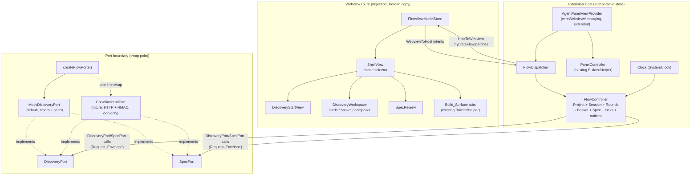

# Design Document

## Overview

This feature adds a **Discovery → Spec** user flow to the existing `program` extension (a VS Code/Kiro webview panel built with TypeScript, an esbuild-bundled framework-free DOM webview, and a Vitest + fast-check suite). The flow precedes the existing Builder/Helper **Build_Surface**: a beginner enters a learning goal, iterates through rounds of generated project candidates, pins/selects candidates, reviews a generated Learning Spec, then confirms it — at which point the project transitions to `BUILDING` and hands off to the existing Builder/Helper panel.

The central design constraint is **swap-without-rewrite**. Today the extension hides its agent transport behind an `AgentAdapter` interface with swappable implementations (`DemoAdapter`, `MockAdapter`, `KiroAcpAdapter`) chosen by a single factory (`createAgentAdapter`). This feature mirrors that pattern exactly: all Discovery/Spec backend calls go through a **`DiscoveryPort` / `SpecPort`** boundary, a **`MockDiscoveryPort`** provides realistic timer-driven mock data now, and a **`createFlowPorts` factory** is the single swap point. The domain types are made **shape-compatible with `core/packages/contracts`** (`discovery.ts`, `learning-spec.ts`, `ui-contracts.ts`) so a future `CrewBackendPort` (HTTP + HMAC, `POST /api/application`) is a drop-in with no UI translation layer.

The other central constraint is **host-owned state**. Exactly like `PanelController` owns per-tab `TabState` and the webview is a pure projection driven by `hydrate`/patch messages, a new **`FlowController`** owns the authoritative Discovery/Spec state (Project + DiscoverySession + accumulated CandidateRounds + Basket + current LearningSpecRevision + per-surface in-flight/lock state + notices) with an injectable `Clock` and `onChange`/`onNotice` callbacks. The webview holds only a `Flow_Snapshot` projection.

This design covers all 15 requirements. It reuses the existing single webview, single dispatcher, single view-provider wiring, and the existing inline-CSS theme system (VS Code theme vars + per-agent accents). All user-visible copy is Korean.

### Design goals and non-goals

- **Goal:** A clean `DiscoveryPort`/`SpecPort` boundary whose method signatures and envelope fields match the `core` UI command contracts, so the real crew-backend swaps in behind `createFlowPorts` without touching the `FlowController` or the webview.
- **Goal:** A pure, deterministic, testable `FlowController` core (injectable `Clock` + mock port) that owns all authoritative state and validation.
- **Goal:** Continuous single-panel experience: Discovery→Spec surfaces render while `Project.status` is `DISCOVERY`/`SPEC_REVIEW`; the existing Builder/Helper tabs are revealed once `BUILDING`, without breaking existing Builder/Helper tests.
- **Non-goal:** Implementing the real crew-backend HTTP client, HMAC signing, streaming chat, or the enrichment/diversity-check agent pipeline. These are referenced only so the boundary is future-proof. The `CrewBackendPort` is documented, not built.
- **Non-goal:** Reimplementing the Build_Surface (Builder/Helper). It is handed off to as-is.

## Architecture

### Layering (mirrors the existing extension)

The feature slots into the existing three-layer structure. New modules are marked **(new)**; existing modules that gain small, additive extensions are marked **(extended)**.

```
program/src/
  core/
    clock.ts                     (reused: Clock + SystemClock, injected into FlowController)
    flow/                        (new)
      flow-types.ts              (new)   domain types, shape-compatible with core/contracts
      flow-controller.ts         (new)   host-owned authoritative state + orchestration
      feedback-validation.ts     (new)   pure Discovery_Feedback intent validation (Req 3)
      flow-snapshot.ts           (new)   Flow_Snapshot projection builder (Req 13)
  adapter/
    flow/                        (new)
      discovery-port.ts          (new)   DiscoveryPort + SpecPort interfaces + Request_Envelope
      mock-flow-port.ts          (new)   MockDiscoveryPort (Discovery + Spec) with real timers + seed
      flow-port-factory.ts       (new)   createFlowPorts() — single swap point
      crew-backend-port.ts       (new, doc-only stub) documents the future HTTP+HMAC adapter
  webview/
    flow/                        (new)
      flow-messages.ts           (new)   HostToWebview/WebviewToHost flow message unions + parse
      flow-dispatcher.ts         (new)   FlowDispatcher (post + handle + hydrateFlow + onNotice)
      flow-view-model.ts         (new)   FlowViewModelStore projection
      flow-render.ts             (new)   DiscoveryStartView/DiscoveryWorkspace/SpecReview renderers
    shell-view-model.ts          (new)   top-level phase selector (flow vs build)
    main.ts                      (extended) route hydrate to flow-shell vs existing panel
  agent-panel-view-provider.ts   (extended) construct FlowController + FlowDispatcher; phase-gate
  extension.ts                   (reused unchanged)
```

The **transport-agnostic port boundary** is the crux: the webview depends only on `HostToWebview`/`WebviewToHost` flow messages (Req 1.7), the `FlowController` depends only on `DiscoveryPort`/`SpecPort` (never a concrete implementation), and `createFlowPorts` is the only place that names a concrete implementation (Req 1.4, 1.5).

### Component diagram



### Message flow directions

Identical topology to the existing panel: **one-directional per direction.**

- Host → Webview: `FlowController.onChange` (async mutations, e.g. a timer-driven mock round completing) and inbound-intent handling both drive `FlowDispatcher.hydrateFlow()`, which posts a `hydrateFlow` snapshot (interim full-refresh strategy, exactly as the existing provider does with `hydrateAll()`).
- Webview → Host: user actions post `WebviewToHost` flow intents; the `FlowDispatcher` validates and applies them to the `FlowController`.

### Discovery → Spec sequence

```mermaid
sequenceDiagram
  actor User
  participant WV as Webview
  participant FD as FlowDispatcher
  participant FC as FlowController
  participant DP as DiscoveryPort (mock)
  participant SP as SpecPort (mock)

  User->>WV: enter learning goal, submit (Req 4)
  WV->>FD: startDiscovery { input }
  FD->>FC: startDiscovery
  FC->>FC: create Project(status=DISCOVERY), arm 30s timeout
  FC->>DP: startDiscovery(env)  %% Req 4.4
  DP-->>FC: DiscoverySession
  FC->>DP: generatePreviewRound(env)  %% Req 4.5
  DP-->>FC: PreviewRound (10 candidates)
  FC-->>FD: onChange
  FD-->>WV: hydrateFlow (phase=DISCOVERY_WORKSPACE)

  User->>WV: pin/merge/revise + free text (Req 7)
  WV->>FD: submitRefinement { action, text, targets }
  FD->>FC: submitFeedback
  FC->>FC: validate intent (Req 3); single-flight lock (Req 14.5)
  FC->>DP: submitFeedback(env)  %% Req 7.9
  DP-->>FC: CandidateRound (roundIndex+1)
  FC->>FC: accumulate round, preserve basket (Req 6.4)
  FC-->>FD: onChange
  FD-->>WV: hydrateFlow (accumulated rounds)

  User->>WV: select candidate to proceed (Req 8)
  WV->>FD: selectCandidate { target }
  FD->>FC: submitFeedback(SELECT)
  FC->>FC: Project.status = SPEC_REVIEW
  FC->>SP: generateSpecDraft(env)  %% Req 8.4
  SP-->>FC: LearningSpecRevision (DRAFT)
  FC-->>FD: onChange
  FD-->>WV: hydrateFlow (phase=SPEC_REVIEW)

  User->>WV: refine spec (Req 10) / confirm (Req 11)
  WV->>FD: confirmSpec { expectedRevision }
  FD->>FC: confirmSpec
  FC->>SP: confirmSpec(env)  %% Req 11.2
  SP-->>FC: LearningSpecRevision (CONFIRMED)
  FC->>FC: Project.status = BUILDING
  FC->>SP: prepareBuilderTask(env)  %% Req 11.4
  SP-->>FC: PreparedBuilderTask
  FC-->>FD: onChange
  FD-->>WV: hydrateFlow (phase=BUILDING → reveal Build_Surface, Req 12.3)
```

## Components and Interfaces

### Port boundary: `DiscoveryPort` and `SpecPort` (Req 1)

The two interfaces live in `adapter/flow/discovery-port.ts`. Every operation is **async** (returns a `Promise`), takes a typed request plus a `Request_Envelope`, and returns a typed result. The signatures mirror the `core` UI command contracts (`UI_START_DISCOVERY`, `UI_RECORD_DISCOVERY_FEEDBACK`, `UI_UPDATE_LEARNING_SPEC`, `UI_CONFIRM_LEARNING_SPEC`, `UI_PREPARE_BUILDER_TASK`) so a future HTTP adapter maps 1:1.

```typescript
/** Metadata every port call carries so a backend swap is seamless (Req 1.6). */
export interface RequestEnvelope {
  /** Correlates a request/response pair across the boundary (corr_ UUID). */
  correlationId: string;
  /** Dedupe key so a retried call is idempotent (idem_ UUID). */
  idempotencyKey: string;
  /**
   * Optimistic-concurrency guard: the revision the caller believes is current
   * for the entity this op targets (session or spec). Nonnegative int.
   * Mirrors core's expectedSessionRevision / expectedSpecRevision.
   */
  expectedRevision: number;
}

/** Normalized, transport-agnostic port failure (mirrors AdapterError). */
export interface PortError {
  code: "timeout" | "revision_conflict" | "unavailable" | "invalid" | "unknown";
  message: string;
}

/** A port operation resolves to ok(value) or err(PortError); it never throws. */
export type PortResult<T> =
  | { ok: true; value: T }
  | { ok: false; error: PortError };

export interface DiscoveryPort {
  /** Open a Discovery_Session from a Discovery_Input (Req 1.1, 4.4). */
  startDiscovery(
    req: { projectId: string; input: DiscoveryInput },
    env: RequestEnvelope,
  ): Promise<PortResult<DiscoverySession>>;

  /** Request the first / next Preview_Round of 10 candidates (Req 1.1, 4.5). */
  generatePreviewRound(
    req: { discoverySessionId: string },
    env: RequestEnvelope,
  ): Promise<PortResult<PreviewRound>>;

  /** Enrich one Candidate_Preview into a Project_Candidate_Revision (Req 1.1). */
  enrichCandidate(
    req: { discoverySessionId: string; target: CandidateRevisionReference },
    env: RequestEnvelope,
  ): Promise<PortResult<ProjectCandidateRevision>>;

  /** Apply Discovery_Feedback and produce the resulting Candidate_Round (Req 1.1, 7.9). */
  submitFeedback(
    req: { discoverySessionId: string; feedback: DiscoveryFeedback },
    env: RequestEnvelope,
  ): Promise<PortResult<CandidateRound>>;
}

export interface SpecPort {
  /** Generate a Learning_Spec_Revision draft for a selected candidate (Req 1.2, 8.4). */
  generateSpecDraft(
    req: { projectId: string; selectedCandidate: CandidateRevisionReference },
    env: RequestEnvelope,
  ): Promise<PortResult<LearningSpecRevision>>;

  /** Refine the current draft into a new DRAFT revision (Req 1.2, 10.2). */
  refineSpec(
    req: { projectId: string; learningSpecId: string; message: string },
    env: RequestEnvelope,
  ): Promise<PortResult<LearningSpecRevision>>;

  /** Confirm the current revision (→ CONFIRMED) (Req 1.2, 11.2). */
  confirmSpec(
    req: { projectId: string; learningSpecId: string },
    env: RequestEnvelope,
  ): Promise<PortResult<LearningSpecRevision>>;

  /** Prepare the Builder handoff task once BUILDING (Req 1.2, 11.4). */
  prepareBuilderTask(
    req: { projectId: string; learningSpecId: string },
    env: RequestEnvelope,
  ): Promise<PortResult<PreparedBuilderTask>>;
}

/** The pair the factory returns and the controller consumes. */
export interface FlowPorts {
  discovery: DiscoveryPort;
  spec: SpecPort;
}
```

Design notes:

- **`PortResult` instead of throwing.** The existing `AgentAdapter` resolves a handle to mean "accepted" and surfaces failures as events. Because the port operations are request/response (not streaming), a discriminated `PortResult` is the cleaner analogue: the `FlowController` never has to `try/catch` and every failure carries a normalized `PortError`, matching the controller's notice-driven error handling (Req 14.3). The mock resolves an `err` for scripted failures; a future HTTP adapter maps 4xx/5xx and timeouts to `PortError`.
- **`revision_conflict`** is a distinct `PortError.code` so the controller can implement Req 11.9 (optimistic-revision mismatch → "spec has changed" notice) without string-matching.
- **Envelope supplied by the host, always.** The `FlowController` builds a fresh `RequestEnvelope` for every call (Req 1.6): a new `correlationId`, a new `idempotencyKey`, and the `expectedRevision` read from its authoritative state.

### Port factory: single swap point (Req 1.4, 1.5)

`adapter/flow/flow-port-factory.ts` mirrors `createAgentAdapter` exactly:

```typescript
import type { FlowPorts } from "./discovery-port";
import { MockDiscoveryPort } from "./mock-flow-port";

/**
 * The single construction/swap point for the concrete Discovery/Spec ports.
 * Returns the MockDiscoveryPort by default (Req 1.5). When the crew-backend
 * transport lands, this becomes a one-line change:
 *
 *   const http = createCrewHttpTransport(...); // proxy HMAC, base URL
 *   const port = new CrewBackendPort(http);
 *   return { discovery: port, spec: port };
 *
 * The CrewBackendPort would POST to `/api/application` with an
 * `x-kirocrew-proxy: <timestamp>:<hmacSHA256>` header and a body carrying
 * `clientProtocolVersion` (CREW_UI_PROTOCOL_VERSION). See crew-backend-port.ts
 * for the documented (unimplemented) contract. This factory is the ONLY place
 * that names a concrete implementation, so the controller and webview never
 * change when swapping.
 */
export function createFlowPorts(options: { seed?: number } = {}): FlowPorts {
  const port = new MockDiscoveryPort({ seed: options.seed });
  return { discovery: port, spec: port };
}
```

`crew-backend-port.ts` is a **doc-only stub** (an exported class throwing `not implemented`, plus a JSDoc block spelling out `POST /api/application`, the `x-kirocrew-proxy` timestamped HMAC-SHA256 signature over `${timestamp}:POST:${target}:${sha256(body)}`, and `clientProtocolVersion: 3`). It compiles and documents the swap but is never wired.

### `MockDiscoveryPort` (Req 3 data, Req 15)

One combined class in `adapter/flow/mock-flow-port.ts` implements both `DiscoveryPort` and `SpecPort` (as `createFlowPorts` returns the same instance for both). It mirrors `DemoAdapter`'s **real-timer** approach so the UI streams/loads believably, but is **deterministic-enough for tests** via an injectable clock/seed.

```typescript
export interface MockPortOptions {
  /** Deterministic RNG seed so tests get repeatable data (Req 15). */
  seed?: number;
  /** Injectable clock so tests drive latency without real waits. Defaults to SystemClock. */
  clock?: Clock;
  /** Simulated per-op latency window in ms (defaults ~600–1400ms, < 30s budgets). */
  latency?: { minMs: number; maxMs: number };
  /** Optional scripted failures for a given op, so error paths are testable. */
  failures?: Partial<Record<MockOp, PortError>>;
}
```

Behavior per Req 15:

- **Preview rounds:** exactly 10 `CandidatePreview` with `position` 1..10 and unique `candidateId`s (Req 15.1); a seeded generator draws from varied Korean title/summary/appeal pools and 1..4 varied `generationTags` so the 10 cards differ (Req 15.2). Curated corpora (project themes, interaction verbs, appeal phrases) keep the output realistic.
- **Enrichment:** returns a `ProjectCandidateRevision` with non-empty `targetUsers`, `coreConcepts`, `mvpFeatures`, and `suggestedScope` (learnerFocus/agentSupport/excluded) (Req 15.3), `revision` starting at 1 with empty `parentRevisions` (later revisions carry lineage per contract).
- **Spec draft:** `status: "DRAFT"`, `runtimeConstraint: "TYPESCRIPT"`, non-empty `productPurpose`/`mvpFeatures`/`scope` (with all three scope categories represented)/`expectedDecisions` (Req 15.4).
- **Feedback → round:** returns a `CandidateRound` whose `roundIndex` is strictly greater than the prior round's and whose `appliedFeedbackIds` include the submitted feedback id (Req 15.5). `SELECT`/`PIN` preserve the referenced candidates; `MORE`/`REGENERATE` add fresh candidates; `MERGE` synthesizes a combined candidate.
- **Latency via injected clock:** each op schedules its resolve with `clock.setTimeout` at a seeded latency in `[minMs, maxMs]`. Under `SystemClock` this is a real ~1s load; under a fake clock, tests advance time to resolve deterministically. All latencies sit well under the controller's 30s timeouts.

### `FlowController` (host-side authoritative core; Req 3, 4, 6, 8, 10, 11, 13, 14)

`core/flow/flow-controller.ts` is the analogue of `PanelController`: a pure, injected-dependency core owning all Discovery/Spec state. It never imports VS Code or a concrete port.

```typescript
export type FlowSurface = "discovery" | "spec";

export interface FlowControllerOptions {
  clock?: Clock;                 // defaults to SystemClock (deterministic in tests)
  onNotice?: (n: FlowNotice) => void;
  onChange?: () => void;         // async mutations → host re-hydrates the webview
  /** Deterministic id source for correlationId/idempotencyKey/entity ids in tests. */
  ids?: IdSource;
}

export class FlowController {
  constructor(ports: FlowPorts, options?: FlowControllerOptions);

  // --- projection for the webview ---
  snapshot(): FlowSnapshot;                    // Req 13.2

  // --- Discovery Start (Req 4) ---
  startDiscovery(input: DiscoveryInput): Promise<void>;

  // --- Refinement / feedback (Req 3, 6, 7, 8) ---
  toggleBasket(ref: CandidateRevisionReference): void;   // Req 6.1/6.2
  submitFeedback(feedback: DiscoveryFeedbackInput): Promise<FeedbackResult>;

  // --- Spec review (Req 10, 11) ---
  refineSpec(message: string): Promise<void>;
  confirmSpec(): Promise<void>;
}
```

Owned state (single source of truth, Req 13.1):

| Field | Purpose | Requirements |
|---|---|---|
| `project: Project \| null` | id/title/learningGoal/status | 2.1, 8.3, 11.3 |
| `lastSuccessfulStatus: ProjectStatus` | restore target on failure | 11.7, 11.8, 14.3 |
| `session: DiscoverySession \| null` | monotonic `revision` for optimistic concurrency | — |
| `input: DiscoveryInput \| null` | retained on failure for resubmission | 4.7, 4.8, 4.9 |
| `rounds: CandidateRound[]` | accumulated rounds, ascending `roundIndex` | 5.4, 6.4 |
| `candidatesByRef: Map<refKey, ProjectCandidateRevision>` | enriched candidate store | 5.3 |
| `basket: Set<refKey>` | selected/pinned references | 6.1–6.4 |
| `spec: LearningSpecRevision \| null` | current draft/confirmed spec | 9, 10, 11 |
| `inFlight: Record<FlowSurface, InFlightOp \| null>` | per-surface single-flight lock + timer | 14.1, 14.5, 4.9, 11.8 |
| `notices: FlowNotice[]` | append-only error/validation notices | 3.9, 14.3 |

Key behaviors:

- **Single-flight lock per surface (Req 14.5).** `inFlight.discovery` and `inFlight.spec` are the locks. While a surface's op is in flight, a new op of the same kind is rejected and the in-flight op stays active. This mirrors `PanelController`'s per-tab `inFlight` map. The `discovery` surface covers start/preview/feedback; the `spec` surface covers draft/refine/confirm/prepare.
- **Timeouts (Req 4.9, 11.8, 14.4).** Every port op arms a `clock.setTimeout(TIMEOUT_MS)` (30s) at call time, cleared on resolution. On fire: treat as failure, emit a timeout notice, restore `lastSuccessfulStatus`, retain `input` (start), re-enable the surface. Reuses the `clock.ts` `Clock`/`TimerId` abstraction verbatim.
- **Feedback validation before any port call (Req 3).** `submitFeedback` runs `validateFeedback` (pure, in `feedback-validation.ts`) first; on rejection it emits a notice, leaves session state and basket unchanged (Req 3.9), and never calls the port. Only a valid feedback triggers exactly one `submitFeedback` port call (Req 3.7).
- **Round accumulation + basket preservation (Req 6.4).** A new `CandidateRound` is appended (never replacing prior rounds); the basket keeps every `refKey` still present across the accumulated candidate set.
- **Optimistic-revision handling (Req 11.9).** `confirmSpec` sends `expectedRevision = spec.revision`; a `revision_conflict` `PortError` produces a "스펙이 변경되었습니다" notice, leaves `Project.status` unchanged, and re-enables the confirm control.
- **onChange for async updates (Req 13.4).** Any state mutation not driven by an inbound intent (a mock round resolving on a timer, a timeout firing) calls `onChange` so the host re-hydrates — identical to `PanelController.notifyChange()`.

### Feedback-to-intent mapping (Req 7, 8)

The webview composer maps UI actions to intents; the controller re-validates. Mapping (validated against `discoveryFeedbackSchema`):

| UI action (Korean label) | Intent | Targets | Requirement |
|---|---|---|---|
| 좁히기 (narrow) | `REVISE` | exactly 1 selected | 7.2, 7.3 |
| 합치기 (merge) | `MERGE` | ≥ 2 selected | 7.4, 7.5 |
| 새 방향 (new direction) | `REGENERATE` | 0 | 7.6 |
| 더 보기 (show more) | `MORE` | 0 | 7.7 |
| 이걸로 진행 (proceed) | `SELECT` | exactly 1 | 8.2 |
| 담기/빼기 (basket toggle) | (local) `PIN`/remove | — | 6.1, 6.2 |

Free text present at submission is attached as `feedback.message` (Req 7.8).

### `FlowDispatcher` (webview messaging; Req 12.4)

**Decision: add a dedicated `FlowDispatcher` rather than overloading `WebviewDispatcher`.** Rationale:

- The existing `WebviewDispatcher` is tightly bound to `PanelController`'s tab/turn API; the flow domain is entirely different (rounds, basket, spec). Overloading it would tangle two unrelated state machines.
- A parallel `FlowDispatcher` follows the *exact same shape* (`post` callback, `handle(intent)`, `hydrateFlow()` full-refresh, `onNotice` forward-reference closure) so it is cohesive with the established pattern (Req 12.4 — reuse the dispatch/projection pattern, not necessarily the same class).
- Both dispatchers coexist behind **one webview** and **one view provider**; a top-level phase selector decides which surface renders (see Shell integration). This keeps the "single-webview, host-owns-state" contract intact.

```typescript
export class FlowDispatcher {
  constructor(controller: FlowController, post: (m: HostToWebviewFlow) => void);
  readonly onNotice: (n: FlowNotice) => void;   // forward-ref closure, as WebviewDispatcher
  forwardNotice(n: FlowNotice): void;
  hydrateFlow(): void;                            // posts { type: "hydrateFlow", snapshot }
  handle(msg: WebviewToHostFlow): Promise<void>;  // applies intents to the controller
}
```

### Webview UI surfaces (Req 4, 5, 7, 9, 10, 11)

`webview/flow/flow-render.ts` renders framework-free DOM using the **existing inline-CSS design system** (VS Code theme vars, 8px spacing scale, per-agent accents, radius/transition tokens) already defined in `buildWebviewHtml`. All copy is Korean. Renderers mirror `PanelRenderer`'s idempotent build-once/update-in-place style and take a `FlowRenderCallbacks` object.

- **`DiscoveryStartView` (Req 4):** required Learning Goal input (1–240 chars) + optional personalNeed/recentFriction/currentLevel; submit disabled while empty/whitespace (Req 4.2) or > 240 chars with a length notice (Req 4.3); Agent_Run_Banner while starting (Req 4.6).
- **`DiscoveryWorkspace` (Req 5, 6, 7, 8):** round rationale + `roundIndex` header (Req 5.2); accumulated rounds in ascending order (Req 5.4); 10 candidate cards each showing title/summary/appeal/coreInteraction/generationTags (Req 5.1) and, when enriched, coreConcepts + suggestedScope (Req 5.3); basket affordance with per-card selection state (Req 6.3); Refinement_Composer (≤ 2000-char free text + action buttons, Req 7.1) with client-side guards for narrow/merge (Req 7.3, 7.5); select-to-proceed control per card (Req 8.1); Agent_Run_Banner during any discovery op (Req 5.5, 7.11).
- **`SpecReview` (Req 9, 10, 11):** productPurpose one-liner (Req 9.1); targetUsers/primaryUsageMoment/successMoment (Req 9.2); mvpFeatures (Req 9.3); scope grouped into Learner Focus / Agent Support / Excluded with conceptNames rendered as chips (Req 9.4); each Expected_Decision with category/description/whyUserInputMatters (Req 9.5); runtimeConstraint + deploymentConstraints (Req 9.6); a refine free-text input (Req 10.1) and a "이걸로 시작" confirm control (Req 11.1); Agent_Run_Banner during refine/confirm with controls disabled (Req 10.4, 11.6).

### Shell integration (Req 12)

The webview gains a **top-level phase** in its view model that selects which surface to render, so the flow and the existing Build_Surface coexist in one panel without breaking Builder/Helper tests.

- The `Flow_Snapshot` carries a `phase` derived from `Project.status`:
  - `DISCOVERY` → `phase: "discovery_start"` (no rounds yet) or `"discovery_workspace"` (rounds present)
  - `SPEC_REVIEW` → `phase: "spec_review"`
  - `BUILDING`/`COMPLETED` → `phase: "building"`
- A new `ShellView` (in `shell-view-model.ts` + a small render branch in `main.ts`) renders the flow surfaces while `phase` is discovery/spec, and reveals the **existing** Builder/Helper tabs (rendered by the untouched `PanelRenderer`) when `phase === "building"` (Req 12.2, 12.3).
- **No changes to `PanelController`, `PanelRenderer`, `WebviewDispatcher`, or their messages.** The Build_Surface is mounted lazily and only becomes visible at `building`. Existing tests that construct `PanelController`/`bootstrap` directly still pass because the flow shell is additive: when no flow state exists (existing tests never start discovery), the shell defaults to the current Build_Surface behavior behind a feature branch in `main.ts` that is inert unless a `hydrateFlow` arrives.
- The view provider (`wireWebviewMessaging`, extended) constructs **both** a `FlowController`/`FlowDispatcher` and the existing `PanelController`/`WebviewDispatcher`, routes inbound messages by their discriminator namespace (flow intents vs panel intents), and pushes `hydrateFlow` (and, at `building`, `hydrate`) accordingly.

### Host-owned state and re-hydration (Req 13)

The `FlowController` owns authoritative state (Req 13.1). `flow-snapshot.ts` builds an immutable `FlowSnapshot` (phase, `DiscoveryInput`, accumulated `CandidateRound[]` with their enriched candidates, `basket` refs, current `LearningSpecRevision`, per-surface in-flight flags, latest notice) analogous to `TabStateSnapshot` (Req 13.2). On webview reveal after disposal, the provider pushes a fresh `hydrateFlow`; the `FlowViewModelStore.apply` **fully replaces** the prior projection (rebuilds rounds from the snapshot, no duplication — Req 13.3), exactly like `ViewModelStore`'s hydrate handling. Any host mutation outside an inbound intent pushes an updated projection via `onChange` (Req 13.4).

### Async operation states and error handling (Req 14)

Each surface tracks an in-flight flag surfaced in the snapshot as `inProgress` states so the webview shows the Agent_Run_Banner for the affected surface (Req 14.1). On completion the flag clears (Req 14.2). On failure/timeout, the controller emits a surface-scoped notice and preserves the last successful state (Req 14.3, 14.4). The single-flight lock rejects a same-kind op while one is in flight (Req 14.5).

## Data Models

`core/flow/flow-types.ts` defines the domain types. They are **local** (no import from `core`) but **shape-compatible** with `core/packages/contracts` so a future backend swap needs no translation. Fields the mock does not populate that the contracts mark optional (e.g. `schemaVersion`, `createdAt`, `redactionStatus`, `evaluation`) are included as optional so the same object validates against the core Zod schemas when the real port is wired.

```typescript
// --- Project (mirrors core projectSchema; Req 2.1) ---
export type ProjectStatus = "DISCOVERY" | "SPEC_REVIEW" | "BUILDING" | "COMPLETED";
export interface Project {
  id: string;                 // project_<uuid>
  title: string;
  learningGoal: string;       // <= 240 chars
  status: ProjectStatus;
}

// --- Discovery_Input (mirrors discoveryInputSchema; Req 2.2, 2.3) ---
export type LearnerLevel = "NEW" | "BEGINNER" | "FAMILIAR" | "UNSPECIFIED";
export interface DiscoveryInput {
  learningGoal: string;       // required, 1..240 non-whitespace-only
  personalNeed?: string;
  recentFriction?: string;
  interestAreas?: string[];
  currentLevel?: LearnerLevel;
  freeContext?: string;
}

// --- Discovery_Session ---
export interface DiscoverySession {
  id: string;                 // discovery_session_<uuid>
  projectId: string;
  revision: number;           // monotonic, optimistic concurrency
  input: DiscoveryInput;
  status: "ACTIVE" | "SELECTED" | "ABANDONED";
}

// --- Generation tags + candidate reference ---
export type GenerationTag = "DIRECT" | "EXPAND" | "DISCOVER" | "UPGRADE"; // Req 2.6
export interface CandidateRevisionReference {
  candidateId: string;
  revision: number;
}

// --- Candidate_Preview (mirrors candidatePreviewSchema; Req 2.4) ---
export interface CandidatePreview {
  candidateId: string;
  position: number;           // 1..10
  title: string;
  summary: string;
  coreInteraction: string;
  appeal: string;
  technologyNecessity: string;
  generationTags: GenerationTag[]; // 1..4
}

// --- Preview_Round (exactly 10; Req 2.5) ---
export interface PreviewRound {
  discoverySessionId: string;
  previews: CandidatePreview[];   // length 10, positions 1..10
  generationRationale: string;
}

// --- Suggested scope for a candidate ---
export interface CandidateScopeSuggestion {
  learnerFocus: string[];
  agentSupport: string[];
  excluded: string[];
}

// --- Project_Candidate_Revision (mirrors projectCandidateRevisionSchema; Req 2.7) ---
export interface ProjectCandidateRevision {
  candidateId: string;
  revision: number;
  parentRevisions: CandidateRevisionReference[]; // lineage
  title: string;
  summary: string;
  targetUsers: string[];
  coreInteraction: string;
  usageMoment: string;
  appeal: string;
  personalNeedRelationship?: string;
  technologyNecessity: string;
  coreConcepts: string[];
  mvpFeatures: string[];
  suggestedScope: CandidateScopeSuggestion;
  risks?: string[];
  generationTags: GenerationTag[];
}

// --- Candidate_Round (mirrors candidateRoundSchema; Req 2.8) ---
export interface CandidateRound {
  roundIndex: number;         // 1-based, strictly increasing across rounds
  candidates: CandidateRevisionReference[];
  generationRationale: string;
  appliedFeedbackIds: string[];
}

// --- Discovery_Feedback (mirrors discoveryFeedbackSchema; Req 2.9) ---
export type DiscoveryFeedbackIntent =
  | "PIN" | "REJECT" | "MERGE" | "REVISE" | "SHRINK"
  | "EXPAND" | "REGENERATE" | "MORE" | "SELECT";
export interface DiscoveryFeedback {
  id: string;                 // feedback_<uuid>
  intent: DiscoveryFeedbackIntent;
  targets: CandidateRevisionReference[];
  message?: string;
}
/** The webview-supplied shape before the host assigns an id. */
export type DiscoveryFeedbackInput = Omit<DiscoveryFeedback, "id">;

// --- Learning_Spec_Revision (mirrors learningSpecRevisionSchema; Req 2.10, 2.11) ---
export type LearningSpecStatus = "DRAFT" | "CONFIRMED" | "SUPERSEDED";
export type LearningScopeCategory = "LEARNER_FOCUS" | "AGENT_SUPPORT" | "EXCLUDED";
export interface SpecScopeEntry {
  category: LearningScopeCategory;
  title: string;
  rationale: string;
  conceptNames: string[];
}
export type DecisionCategory =
  | "PRODUCT_BEHAVIOR" | "DATA_MODEL" | "API_CONTRACT" | "AUTHENTICATION"
  | "AUTHORIZATION" | "SECURITY_PRIVACY" | "RETENTION_DELETION"
  | "COST_DEPLOYMENT" | "ARCHITECTURE" | "LEARNING_CONCEPT";
export interface ExpectedDecision {
  category: DecisionCategory;
  description: string;
  whyUserInputMatters: string;
}
export interface LearningSpecRevision {
  id: string;                 // learning_spec_<uuid>
  revision: number;           // monotonic
  parentRevision?: number;
  status: LearningSpecStatus;
  selectedCandidate: CandidateRevisionReference;
  productPurpose: string;
  targetUsers: string[];
  primaryUsageMoment: string;
  successMoment: string;
  mvpFeatures: string[];
  scope: SpecScopeEntry[];
  expectedDecisions: ExpectedDecision[];
  runtimeConstraint: "TYPESCRIPT";
  deploymentConstraints: string[];
}

// --- Prepared Builder handoff task (mirrors preparedBuilderTaskDescriptorSchema) ---
export interface PreparedBuilderTask {
  projectId: string;
  workspacePath: string;
  status: "READY";
}
```

### `refKey` helper

Candidate identity+revision is used pervasively (basket membership, target de-dup in Req 3.6). A single pure helper `refKey(ref) = \`${ref.candidateId}:${ref.revision}\`` (matching core's `candidateReferenceKey`) is the canonical key for `Set`/`Map` membership. Basket entries and feedback-target uniqueness both use it.

### Webview message model (Req 12.4, 13)

`webview/flow/flow-messages.ts` defines two unions parallel to the existing `messages.ts`, with `parse`/`serialize` guards identical in spirit.

```typescript
export type HostToWebviewFlow =
  | { type: "hydrateFlow"; snapshot: FlowSnapshot }              // Req 13.2/13.3
  | { type: "flowNotice"; surface: FlowSurface; kind: FlowNoticeKind; message: string }; // Req 3.9, 14.3

export type WebviewToHostFlow =
  | { type: "startDiscovery"; input: DiscoveryInput }            // Req 4.4
  | { type: "toggleBasket"; ref: CandidateRevisionReference }    // Req 6.1/6.2
  | { type: "submitRefinement"; action: RefinementAction; text: string; targets: CandidateRevisionReference[] } // Req 7
  | { type: "selectCandidate"; target: CandidateRevisionReference } // Req 8.2
  | { type: "refineSpec"; message: string }                     // Req 10.2
  | { type: "confirmSpec" }                                      // Req 11.2
  | { type: "draftChangedFlow"; field: string; text: string };  // Req 13 (draft retention)
```

The interim strategy uses `hydrateFlow` as the single full-refresh vehicle (matching the existing panel's `hydrate`), so no per-field patch messages are required for correctness; they can be added later without changing this contract.

## Acceptance Criteria Testing Prework

PBT **is** applicable to this feature: the `FlowController`, `feedback-validation`, and the state/round/basket/revision core are pure logic with input-dependent behavior over a large input space (arbitrary feedback intents/targets, arbitrary round sequences, arbitrary revisions). The webview rendering, Korean-copy facts, shell phase-gating, and IDE wiring are **not** PBT targets (example/integration/smoke). The pass below classifies every acceptance criterion.

Legend: **PROPERTY** (universal, PBT) · **EXAMPLE** (specific unit test) · **EDGE_CASE** (boundary, covered by generators) · **INTEGRATION** (fake-dom / wiring) · **SMOKE** (one-shot config) · **N/A** (design/architecture statement, no direct test).

**Requirement 1 — Port and adapter boundary**
- 1.1/1.2 Define DiscoveryPort/SpecPort ops. Thoughts: interface existence is structural. Classification: EXAMPLE (type-level + a compile/smoke assertion the mock implements them).
- 1.3 MockDiscoveryPort returns data with no network. Thoughts: mock has no I/O by construction. Classification: EXAMPLE.
- 1.4 Port_Factory returns concrete ports. Classification: EXAMPLE.
- 1.5 Unchanged factory returns the mock. Thoughts: single deterministic default. Classification: SMOKE.
- 1.6 Every op is supplied a Request_Envelope with correlationId/idempotencyKey/expectedRevision. Thoughts: holds for ALL ops and ALL controller calls — a spy port can assert the envelope shape across generated op sequences. Classification: PROPERTY.
- 1.7 Webview references no port type. Thoughts: architectural/import boundary. Classification: N/A (enforced by module structure; a lint/import test at most).

**Requirement 2 — Domain data model mirrors core contracts**
- 2.1–2.11 Type shapes/enums. Thoughts: representational. The valuable universal check is that mock-produced values validate against the core Zod schemas. Classification: PROPERTY (round-trip/shape conformance for generated mock data against the contract schema), plus EXAMPLE for enum literal facts.

**Requirement 3 — Discovery Feedback intent validation** (all pure — the strongest PBT surface)
- 3.1 MERGE with <2 targets → reject, no port call. Classification: PROPERTY.
- 3.2 SELECT without exactly 1 target → reject, no port call. Classification: PROPERTY.
- 3.3 REVISE/SHRINK/EXPAND without exactly 1 target → reject, no port call. Classification: PROPERTY.
- 3.4 MORE with ≥1 target → reject, no port call. Classification: PROPERTY.
- 3.5 REGENERATE with ≥0 targets → accept. Classification: PROPERTY.
- 3.6 Duplicate target (same identity+revision) → reject, no port call. Classification: PROPERTY.
- 3.7 Valid feedback → exactly one submit-feedback port call. Classification: PROPERTY.
- 3.8 Unknown intent → reject, no port call. Classification: PROPERTY (generate off-enum strings).
- 3.9 On rejection → notice emitted AND session/basket unchanged. Classification: PROPERTY.

**Requirement 4 — Discovery Start**
- 4.1 Start form fields (Korean copy). Classification: INTEGRATION (fake-dom) + EXAMPLE (copy).
- 4.2 Submit disabled while empty/whitespace. Thoughts: validation over arbitrary whitespace strings. Classification: PROPERTY.
- 4.3 >240 chars → disabled + length notice. Classification: PROPERTY (any string length >240).
- 4.4 Valid submit → create Project(DISCOVERY) + exactly one start call. Classification: PROPERTY.
- 4.5 Start success → generate-preview call. Classification: PROPERTY.
- 4.6 Banner + disabled while in progress. Classification: INTEGRATION.
- 4.7 Start fail → error notice + retain input + re-enable. Classification: PROPERTY.
- 4.8 Preview fail → error notice + retain input + re-enable. Classification: PROPERTY.
- 4.9 Timeout (30s) → failure + timeout notice + retain input + re-enable. Thoughts: driven by injected clock over any latency > budget. Classification: PROPERTY.

**Requirement 5 — Workspace rendering**
- 5.1 Render 10 cards with fields (Korean). Classification: INTEGRATION.
- 5.2 Show roundIndex + rationale. Classification: INTEGRATION.
- 5.3 Enriched candidate shows coreConcepts + suggestedScope. Classification: INTEGRATION.
- 5.4 New rounds retained + rendered ascending roundIndex. Thoughts: accumulation invariant over arbitrary round sequences (host side). Classification: PROPERTY (host accumulation) + INTEGRATION (render order).
- 5.5 Banner while op in progress. Classification: INTEGRATION.

**Requirement 6 — Basket**
- 6.1 Select → recorded. Classification: PROPERTY.
- 6.2 Remove → removed. Classification: PROPERTY.
- 6.3 Card shows selection state. Classification: INTEGRATION.
- 6.4 New round preserves basket for still-present refs. Classification: PROPERTY.

**Requirement 7 — Refinement Composer**
- 7.1 Composer with ≤2000-char text + actions (Korean). Classification: INTEGRATION + EDGE_CASE (2000-char boundary).
- 7.2 narrow w/ exactly 1 → REVISE. Classification: PROPERTY (mapping) — subsumed by Req 3 validation properties for the host; EXAMPLE for the webview mapping.
- 7.3 narrow w/ 0 or ≥2 → block + message. Classification: PROPERTY (webview guard over selection counts).
- 7.4 merge w/ ≥2 → MERGE. Classification: EXAMPLE (mapping) + PROPERTY via Req 3.
- 7.5 merge w/ <2 → block + message. Classification: PROPERTY (webview guard).
- 7.6 new-direction w/ none → REGENERATE no targets. Classification: EXAMPLE.
- 7.7 show-more → MORE no targets. Classification: EXAMPLE.
- 7.8 free text → feedback.message. Classification: PROPERTY (any text attached).
- 7.9 Accepted → exactly one submit then request round. Classification: PROPERTY (covered with 3.7).
- 7.10 submit-feedback fail → abort round request, error, retain text+selections. Classification: PROPERTY.
- 7.11 Banner + disabled during submit. Classification: INTEGRATION.
- 7.12 Complete/fail → hide banner + re-enable. Classification: INTEGRATION.

**Requirement 8 — Select to proceed**
- 8.1 select-to-proceed control per card. Classification: INTEGRATION.
- 8.2 Select → SELECT feedback exactly that candidate. Classification: PROPERTY.
- 8.3 Select → status SPEC_REVIEW + record ref. Classification: PROPERTY.
- 8.4 Select → generate-draft call. Classification: PROPERTY.
- 8.5 Banner during draft gen. Classification: INTEGRATION.

**Requirement 9 — Spec Review rendering** (all rendering)
- 9.1–9.6 render purpose/users/moments/mvp/scope-groups/chips/decisions/constraints. Classification: INTEGRATION (fake-dom) + EXAMPLE (Korean copy, chip-per-conceptName).

**Requirement 10 — Spec refinement**
- 10.1 refine free-text input (Korean). Classification: INTEGRATION.
- 10.2 Submit → exactly one refine call with current expectedRevision. Classification: PROPERTY.
- 10.3 Refined revision → recorded as new DRAFT + rendered current. Thoughts: revision monotonicity + status. Classification: PROPERTY.
- 10.4 Banner + disable during refine. Classification: INTEGRATION.
- 10.5 Refine fail → error notice + retain prior revision + re-enable. Classification: PROPERTY.

**Requirement 11 — Confirm and handoff**
- 11.1 confirm control (Korean). Classification: INTEGRATION.
- 11.2 Confirm → exactly one confirm call with current expectedRevision. Classification: PROPERTY.
- 11.3 Confirm success → spec CONFIRMED + status BUILDING. Classification: PROPERTY.
- 11.4 BUILDING → prepare-Builder-task call. Classification: PROPERTY.
- 11.5 Prepared → reveal Build_Surface within 2s. Classification: INTEGRATION (functional behavior behind the budget; true timing is @vscode/test-electron follow-up).
- 11.6 Banner + confirm disabled (no double-confirm). Thoughts: single-flight — no second confirm call while in flight. Classification: PROPERTY (with 14.5).
- 11.7 Confirm/prepare fail → error notice + restore prior status + re-enable. Classification: PROPERTY.
- 11.8 Timeout (30s) → failure + timeout notice + restore status + re-enable. Classification: PROPERTY.
- 11.9 Revision conflict → "spec changed" notice + status unchanged + re-enable. Classification: PROPERTY.

**Requirement 12 — Shell integration**
- 12.1 Flow precedes Build tabs. Classification: N/A (structural).
- 12.2 DISCOVERY/SPEC_REVIEW → show flow, not Build tabs. Classification: PROPERTY (phase derivation from status is a pure function) + INTEGRATION (render gating).
- 12.3 BUILDING → reveal Build tabs. Classification: PROPERTY (phase derivation) + INTEGRATION.
- 12.4 Reuse dispatch/projection pattern. Classification: N/A (architectural).

**Requirement 13 — Host-owned state + re-hydration**
- 13.1 Host owns authoritative state; webview projection only. Classification: N/A (architectural, exercised by 13.2/13.3).
- 13.2 Reveal → push Flow_Snapshot restoring phase/input/rounds/basket/spec. Classification: PROPERTY (snapshot faithfully reflects controller state) + INTEGRATION.
- 13.3 Applying snapshot replaces projection without duplicating rounds/candidates. Thoughts: idempotent re-hydrate. Classification: PROPERTY (apply(snapshot) twice ≡ once).
- 13.4 Host mutation outside intent → push projection. Classification: INTEGRATION (onChange fires).

**Requirement 14 — Async states + error handling**
- 14.1 Banner while op in progress. Classification: INTEGRATION (from inProgress flag) — flag correctness is PROPERTY under 14.2.
- 14.2 Op completes → clear in-progress. Classification: PROPERTY.
- 14.3 Op fails → surface notice + preserve last successful state. Classification: PROPERTY.
- 14.4 Timeout → failure + notice + preserve state. Classification: PROPERTY (with 4.9/11.8).
- 14.5 In-flight op for a surface → reject same-kind op, keep in-flight active. Classification: PROPERTY (single-flight).

**Requirement 15 — Mock port data quality**
- 15.1 Preview round: 10 items, positions 1..10, unique ids. Classification: PROPERTY (over seeds).
- 15.2 Varied titles/summaries/tags across 10. Classification: PROPERTY (over seeds).
- 15.3 Enrichment: non-empty targetUsers/coreConcepts/mvpFeatures/suggestedScope. Classification: PROPERTY.
- 15.4 Spec draft: DRAFT + TYPESCRIPT + non-empty purpose/mvp/scope/decisions. Classification: PROPERTY.
- 15.5 Feedback → round with roundIndex > prior AND appliedFeedbackIds include submitted id. Classification: PROPERTY.

### Property Reflection (redundancy elimination)

- Req 3.1–3.4, 3.6, 3.8 are all instances of one law: *"invalid feedback is rejected without a port call."* They are consolidated into a single **arity/validity property** (Property 1) that generates intent+targets and asserts acceptance iff the contract's validation rules hold, with **zero** `submitFeedback` port calls on rejection. Req 3.5 (REGENERATE accepts ≥0) and 3.7 (valid → exactly one call) are the positive half of that same law and fold into Property 1 and Property 2.
- Req 3.9's "session/basket unchanged on rejection" is a distinct observable (state preservation), kept as Property 3.
- Req 4.4/4.5, 8.2/8.3/8.4, 10.2/10.3, 11.2/11.3/11.4 are all "valid action → state transition + exactly-one port call with the right envelope." They share the **envelope/exactly-once** law (Property 2) but differ in the resulting state transition; the transition specifics are folded into per-phase properties (Properties 4, 8, 9, 10) rather than duplicated.
- Req 4.7/4.8/4.9, 10.5, 11.7/11.8, 14.3/14.4 are all "failure/timeout → notice + preserve last-successful state + re-enable." Consolidated into one **failure-preserves-state** property (Property 6) parameterized over which op fails; the timeout case (Property 7) is separated only because it is driven by the injected clock rather than a scripted `err`.
- Req 5.4 and 6.4 combine: round accumulation and basket preservation are one property over a sequence of rounds (Property 5).
- Req 11.6 and 14.5 are the same single-flight law (Property 11).
- Req 15.1–15.5 are independent mock-quality guarantees but 15.1+15.2 combine into one "well-formed varied preview round" property (Property 12); 15.3/15.4/15.5 stay separate (Properties 13, 14, 15) as they assert different outputs.
- Req 2.* conformance is one property: mock output validates against the core schema (Property 16).

## Correctness Properties

*A property is a characteristic or behavior that should hold true across all valid executions of a system — essentially, a formal statement about what the system should do. Properties serve as the bridge between human-readable specifications and machine-verifiable correctness guarantees.*

These properties target the pure `FlowController` + `feedback-validation` + `MockDiscoveryPort` core, driven with an injected `Clock` (fake) and a spy/mock port so port-call counts and envelopes are observable and time is deterministic.

### Property 1: Feedback validity gate

*For any* `DiscoveryFeedbackInput` (arbitrary intent drawn from the enum plus off-enum strings, and an arbitrary list of candidate targets), `FlowController.submitFeedback` invokes the `DiscoveryPort.submitFeedback` operation **iff** the feedback satisfies every validation rule (MERGE ≥ 2 targets; SELECT / REVISE / SHRINK / EXPAND exactly 1 target; MORE 0 targets; REGENERATE ≥ 0 targets; no duplicate identity+revision target; intent is a known enum value); when it does not satisfy them, no port call occurs.

**Validates: Requirements 3.1, 3.2, 3.3, 3.4, 3.5, 3.6, 3.8**

### Property 2: Valid action makes exactly one enveloped port call

*For any* accepted controller action (a valid feedback submission, a valid discovery start, a candidate SELECT, a spec refine, or a spec confirm), the corresponding port operation is invoked **exactly once**, and the `RequestEnvelope` passed carries a non-empty `correlationId`, a non-empty `idempotencyKey`, and an `expectedRevision` equal to the controller's current revision for the targeted entity.

**Validates: Requirements 1.6, 3.7, 7.9, 4.4, 8.2, 10.2, 11.2**

### Property 3: Rejected feedback preserves session and basket

*For any* `DiscoveryFeedbackInput` that fails validation, after `submitFeedback` returns, the accumulated `CandidateRound[]`, the `DiscoverySession` (including its `revision`), and the `basket` selection are all byte-for-byte unchanged from their pre-call values, and exactly one rejection notice is appended.

**Validates: Requirements 3.9**

### Property 4: Discovery start creates a project and requests previews

*For any* `DiscoveryInput` whose `learningGoal` has 1–240 non-whitespace characters, a successful `startDiscovery` results in a `Project` with `status === "DISCOVERY"`, exactly one `DiscoveryPort.startDiscovery` call, and — on its success — exactly one `DiscoveryPort.generatePreviewRound` call.

**Validates: Requirements 4.4, 4.5**

### Property 5: Rounds accumulate and preserve basket membership

*For any* sequence of successful feedback-driven rounds, the controller retains all prior rounds in strictly ascending `roundIndex` order (no round is dropped or replaced), and every basketed `CandidateRevisionReference` that still appears in the accumulated candidate set remains in the basket after each new round.

**Validates: Requirements 5.4, 6.4**

### Property 6: Failure preserves last-successful state and re-enables the surface

*For any* port operation that resolves with a `PortError` (start, preview, feedback, refine, confirm, or prepare), the controller emits exactly one error notice for the affected surface, restores its observable state to the last successful value (`Project.status` restored, `DiscoveryInput` retained for start/preview failures, prior `LearningSpecRevision` retained for refine failures), and clears the surface's in-flight lock so the same action can be retried.

**Validates: Requirements 4.7, 4.8, 10.5, 11.7, 14.3**

### Property 7: Timeout is treated as failure with state preserved

*For any* port operation whose resolution is delayed past the 30-second budget on the injected clock, advancing the clock past the budget causes the controller to treat the operation as failed: it emits a timeout notice for the affected surface, preserves the last successful state, and re-enables the surface — identically to an explicit failure.

**Validates: Requirements 4.9, 11.8, 14.4**

### Property 8: Candidate selection transitions to spec review and drafts a spec

*For any* accepted SELECT feedback targeting exactly one candidate, the controller sets `Project.status` to `SPEC_REVIEW`, records the selected `CandidateRevisionReference`, and invokes `SpecPort.generateSpecDraft` exactly once for that candidate.

**Validates: Requirements 8.2, 8.3, 8.4**

### Property 9: Spec refinement produces a new monotonic DRAFT revision

*For any* current `LearningSpecRevision` and any refine message, a successful `refineSpec` records the returned revision as the current spec with `status === "DRAFT"` and a `revision` strictly greater than the prior revision.

**Validates: Requirements 10.2, 10.3**

### Property 10: Confirmation confirms the spec and advances to building

*For any* current DRAFT `LearningSpecRevision`, a successful `confirmSpec` sets the spec `status` to `CONFIRMED`, sets `Project.status` to `BUILDING`, and then invokes `SpecPort.prepareBuilderTask` exactly once.

**Validates: Requirements 11.3, 11.4**

### Property 11: One operation in flight per surface (single-flight)

*For any* surface (`discovery` or `spec`) with an operation already in flight, invoking another operation of the same kind on that surface does not start a second port call and leaves the original in-flight operation active until it resolves.

**Validates: Requirements 11.6, 14.5**

### Property 12: Confirmation revision conflict is surfaced without status change

*For any* confirm whose `expectedRevision` does not match the port's latest stored revision (the port returns a `revision_conflict` `PortError`), the controller emits a "spec has changed" notice, leaves `Project.status` unchanged, and re-enables the confirm control.

**Validates: Requirements 11.9**

### Property 13: In-progress state is set on start and cleared on settle

*For any* port operation, the affected surface's `inProgress` flag is `true` from the moment the operation is invoked until it resolves, and is `false` once the operation completes or fails.

**Validates: Requirements 14.1, 14.2**

### Property 14: Flow snapshot round-trips controller state without duplication

*For any* reachable `FlowController` state, building a `FlowSnapshot` and applying it to a fresh `FlowViewModelStore` reproduces the phase, `DiscoveryInput`, accumulated rounds (same order and count), basket selection, and current `LearningSpecRevision`; applying the same snapshot twice yields the same projection as applying it once (no duplicated rounds or candidates).

**Validates: Requirements 13.2, 13.3**

### Property 15: Phase derives deterministically from project status

*For any* `Project.status`, the derived shell `phase` is `discovery_start`/`discovery_workspace` when `DISCOVERY`, `spec_review` when `SPEC_REVIEW`, and `building` when `BUILDING` or `COMPLETED`; the flow surfaces render exactly when `phase` is a discovery/spec phase and the Build_Surface renders exactly when `phase` is `building`.

**Validates: Requirements 12.2, 12.3**

### Property 16: Mock preview rounds are well-formed and varied

*For any* seed, a `MockDiscoveryPort` preview round contains exactly 10 `CandidatePreview` items whose `position` values are exactly 1 through 10, whose `candidateId`s are all unique, each with 1–4 `generationTags`, and with more than one distinct `title` across the 10 cards.

**Validates: Requirements 15.1, 15.2**

### Property 17: Mock enrichment and spec drafts are fully populated

*For any* seed and candidate, a `MockDiscoveryPort` enrichment yields non-empty `targetUsers`, `coreConcepts`, `mvpFeatures`, and every `suggestedScope` list is present; and a generated `LearningSpecRevision` has `status === "DRAFT"`, `runtimeConstraint === "TYPESCRIPT"`, and non-empty `productPurpose`, `mvpFeatures`, `scope`, and `expectedDecisions`.

**Validates: Requirements 15.3, 15.4**

### Property 18: Mock feedback advances the round monotonically

*For any* seed and any submitted feedback with a known id, the `MockDiscoveryPort`-produced `CandidateRound` has a `roundIndex` strictly greater than the prior round's `roundIndex` and an `appliedFeedbackIds` list containing that feedback id.

**Validates: Requirements 15.5**

### Property 19: Mock output conforms to the core contract shape

*For any* seed, every `PreviewRound`, `ProjectCandidateRevision`, `CandidateRound`, and `LearningSpecRevision` produced by the mock validates against the corresponding `core/packages/contracts` Zod schema (allowing for optional envelope fields), so a future backend swap needs no shape translation.

**Validates: Requirements 2.1, 2.4, 2.5, 2.7, 2.8, 2.10, 2.11, 15.1, 15.3, 15.4**

## Error Handling

Error handling mirrors `PanelController`'s additive, state-preserving model: notices are append-only, no successful state is mutated on failure, and every asynchronous path has a bounded timeout via the injected `Clock`.

### Failure taxonomy and controller response

| Failure | Detection | Controller response | Requirement |
|---|---|---|---|
| Validation rejection | `validateFeedback` before any port call | Emit rejection notice; leave session/basket unchanged; no port call | 3.1–3.9 |
| Start op fails | `PortResult.ok === false` | Error notice; retain `DiscoveryInput`; re-enable start; keep `status` | 4.7 |
| First-preview fails | `PortResult.ok === false` | Error notice; retain `DiscoveryInput`; re-enable start | 4.8 |
| Feedback submit fails | `PortResult.ok === false` | Error notice; **abort** the round request; retain composer text + selections | 7.10 |
| Spec refine fails | `PortResult.ok === false` | Error notice; retain prior `LearningSpecRevision`; re-enable refine + confirm | 10.5 |
| Confirm / prepare fails | `PortResult.ok === false` | Error notice; restore `lastSuccessfulStatus`; re-enable confirm | 11.7 |
| Revision conflict | `PortError.code === "revision_conflict"` | "스펙이 변경되었습니다" notice; leave `status`; re-enable confirm | 11.9 |
| Timeout (any op) | `clock.setTimeout(30_000)` fires before resolution | Treat as failure; timeout notice; preserve last successful state; re-enable surface | 4.9, 11.8, 14.4 |
| Same-kind op while in-flight | `inFlight[surface] !== null` | Reject new op; keep in-flight op active | 14.5 |

### Design principles

- **`PortResult` over exceptions.** Ports never throw; they resolve `{ ok: false, error }`. The controller has a single settlement path per op that (a) guards against a stale/duplicate resolution after a timeout already fired, (b) clears the timer, (c) clears the in-flight lock, and (d) applies the success/failure branch. This is the direct analogue of `PanelController`'s terminal-event handling.
- **Last-successful snapshot.** Before mutating `Project.status` optimistically (e.g. `SPEC_REVIEW` on select, `BUILDING` on confirm), the controller records `lastSuccessfulStatus` so a later failure restores it precisely (Req 11.7).
- **Notices are additive (Req 3.9, 14.3).** Emitting a notice never touches rounds, basket, session, or spec — exactly like `PanelController.emitNotice`. The webview surfaces the latest notice per surface; a re-`hydrateFlow` resets transient notices to none (mirroring `ViewModelStore`'s hydrate clearing notices).
- **Timeout/stale-resolution race.** A per-op token guards the settlement: if the timeout fires first, the later real resolution is ignored (no double notice, no resurrecting a failed op) — analogous to the controller nulling `inFlight` before a late event arrives.
- **Untrusted webview input.** `parseWebviewToHostFlow` validates every inbound message discriminator (as `parseWebviewToHost` does) and drops malformed payloads; the controller re-validates feedback intent/targets regardless of any webview-side guard, so a buggy or hostile webview cannot bypass Req 3.
- **Webview render failure.** A render-failure hook (as `PanelController.reportRenderFailure`) emits a notice and returns the preserved snapshot for re-render, never mutating flow state.

## Testing Strategy

Testing follows the existing suite's conventions exactly: **Vitest + fast-check**, property tests at **minimum 100 runs**, one property per test, tagged with a comment referencing the design property, example tests for structural/Korean-copy facts, and integration tests through the shared in-memory DOM harness (`test/support/fake-dom.ts`). The `vscode` module is mocked as in `integration.test.ts`.

### Dual approach

- **Property-based tests (fast-check):** the pure `FlowController` + `feedback-validation` + `MockDiscoveryPort` core (Properties 1–19). Driven with a **fake `Clock`** (to make timeouts deterministic) and a **spy port** (to count calls and inspect envelopes). fast-check generators produce arbitrary feedback intents/targets, input strings, round sequences, revisions, and seeds.
- **Example / edge-case unit tests:** enum literal facts (Req 2.3, 2.6, 2.11), the feedback→intent action mapping (Req 7.2, 7.4, 7.6, 7.7), the 2000-char composer boundary (Req 7.1), and specific Korean copy strings.
- **Integration tests (fake-dom):** the webview surfaces and shell gating (Req 4.1/4.6, 5.*, 7.11/7.12, 9.*, 11.5, 12.2/12.3, 13.4) via a `FlowHostWebviewHarness` modeled on `HostWebviewHarness` in `integration.test.ts` — wire a real `FlowController` + `FlowDispatcher` to a real `FlowViewModelStore` + flow renderer through a `WebviewClient`, and assert rendered DOM.

### Property test configuration

- **Library:** `fast-check` (already a dependency). Do **not** hand-roll property testing.
- **Runs:** each property test configured with `{ numRuns: 100 }` minimum.
- **One property per test.** Each `it(...)` implements exactly one design property.
- **Tag format** (comment on each property test):
  `// Feature: discovery-spec-flow, Property N: <property text>`
- **Deterministic dependencies:** inject a fake `Clock` (advance time to fire timeouts) and a deterministic `IdSource`; use a spy `FlowPorts` recording `{ op, req, env }` per call so exactly-once and envelope assertions (Property 2) are precise. For mock-quality properties (16–19) drive the real `MockDiscoveryPort` over generated seeds.

### Example property test skeleton

```typescript
import fc from "fast-check";
import { describe, it, expect } from "vitest";
import { FlowController } from "../src/core/flow/flow-controller";
import { SpyFlowPorts } from "./support/spy-flow-ports";
import { FakeClock } from "./support/fake-clock";

describe("FlowController feedback validation", () => {
  // Feature: discovery-spec-flow, Property 1: Feedback validity gate
  it("invokes submitFeedback iff the feedback is valid", () => {
    fc.assert(
      fc.property(arbFeedbackInput(), (feedback) => {
        const ports = new SpyFlowPorts();
        const fc_ = new FlowController(ports, { clock: new FakeClock(), ids: seededIds() });
        // ...place controller in a discovery-workspace state...
        void fc_.submitFeedback(feedback);
        const called = ports.calls.filter((c) => c.op === "submitFeedback").length;
        expect(called).toBe(isValidFeedback(feedback) ? 1 : 0);
      }),
      { numRuns: 100 },
    );
  });
});
```

### Test-to-property mapping

| Test kind | Covers |
|---|---|
| Property (fast-check, 100 runs) | Properties 1–19 → Req 1.6, 2.*, 3.*, 4.4/4.5/4.7/4.8/4.9, 5.4, 6.1/6.2/6.4, 7.8/7.9/7.10, 8.2/8.3/8.4, 10.2/10.3/10.5, 11.2/11.3/11.4/11.6/11.7/11.8/11.9, 12.2/12.3, 13.2/13.3, 14.1–14.5, 15.* |
| Example / edge | Req 1.1–1.5, 2.3/2.6/2.11, 7.1–7.7 mapping, Korean copy |
| Integration (fake-dom) | Req 4.1/4.6, 5.1–5.5, 7.11/7.12, 8.1/8.5, 9.1–9.6, 10.1/10.4, 11.1/11.5, 12.2/12.3, 13.4 |
| Smoke | Req 1.5 (factory default returns mock) |

### Environmental caveats (not asserted in-process)

Mirroring the existing `integration.test.ts` caveat: the millisecond budgets (reveal Build_Surface within 2s, Req 11.5; render latencies) are properties of the real VS Code/Electron host and webview paint pipeline. They are **not** asserted in-process. Instead the **functional behavior** behind each budget is verified (e.g. confirm success → phase becomes `building` → shell reveals Build_Surface). True budget verification via `@vscode/test-electron` is a documented follow-up, consistent with the existing suite.

### Regression guard for existing Builder/Helper tests

The shell integration is additive: a `FlowHostWebviewHarness` is new, and the existing `HostWebviewHarness`, `bootstrap`, `PanelController`, and `WebviewDispatcher` tests are untouched. A dedicated integration test asserts that with no `hydrateFlow` ever posted (the existing-tests scenario) the Build_Surface renders exactly as before, and that `main.ts`'s phase branch is inert until a `hydrateFlow` arrives — guaranteeing Req 12 does not regress the existing panel.
